# PCAPCaper

| English  | Italian  |
| ------------ | ------------ |
|  here | file: readme.ita.md  |


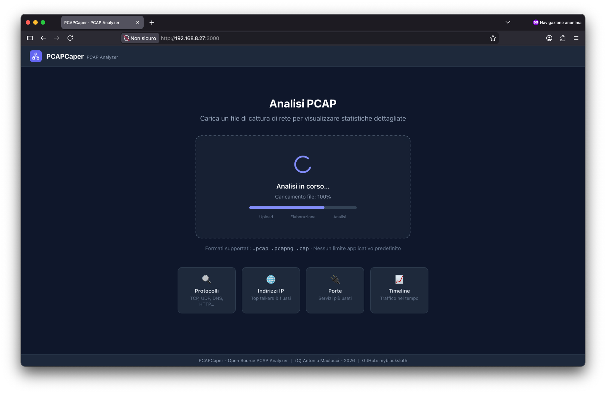

<!-- home -->

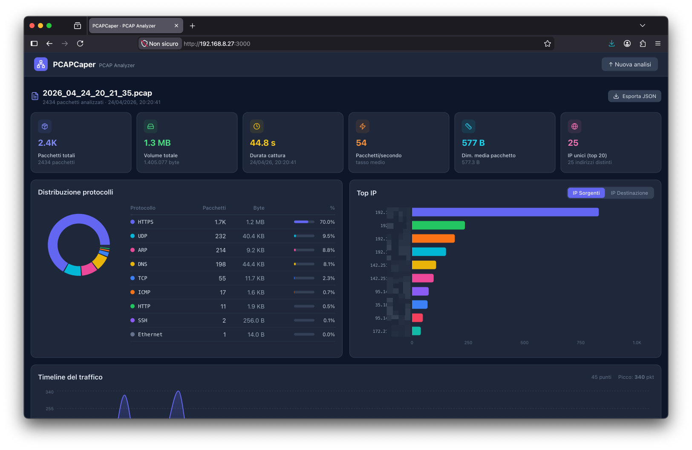

<!-- home -->

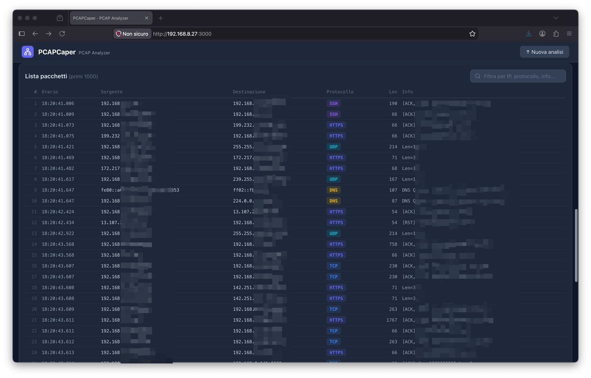

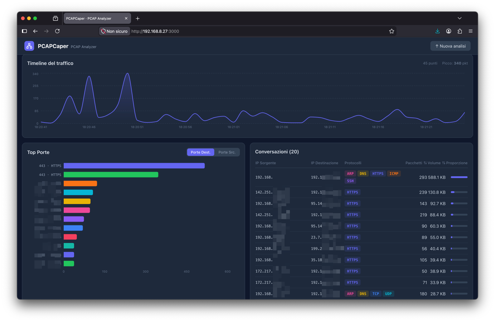

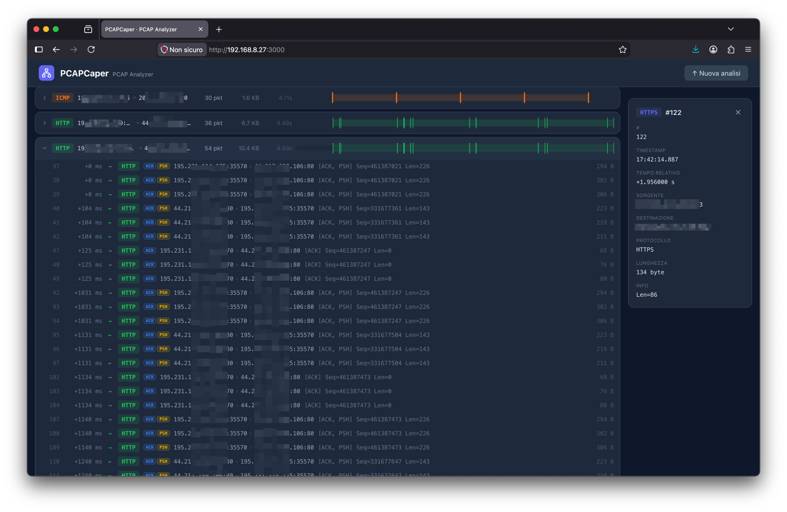

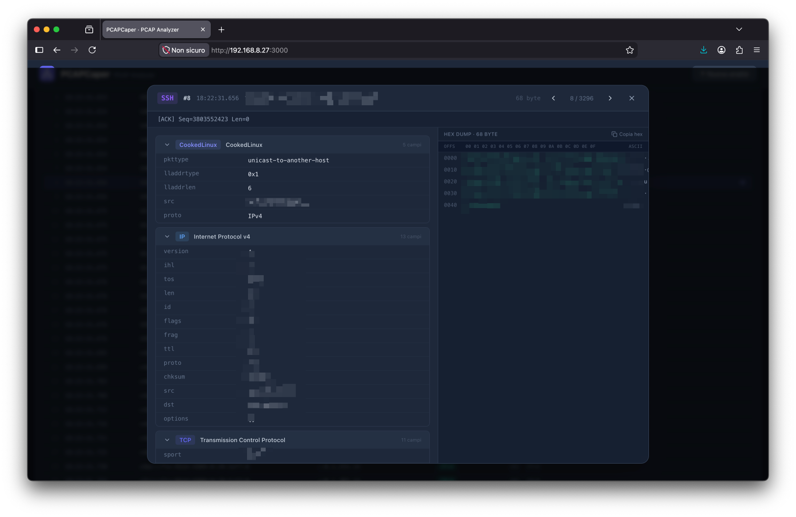

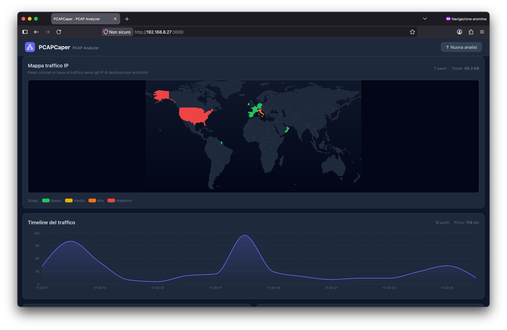

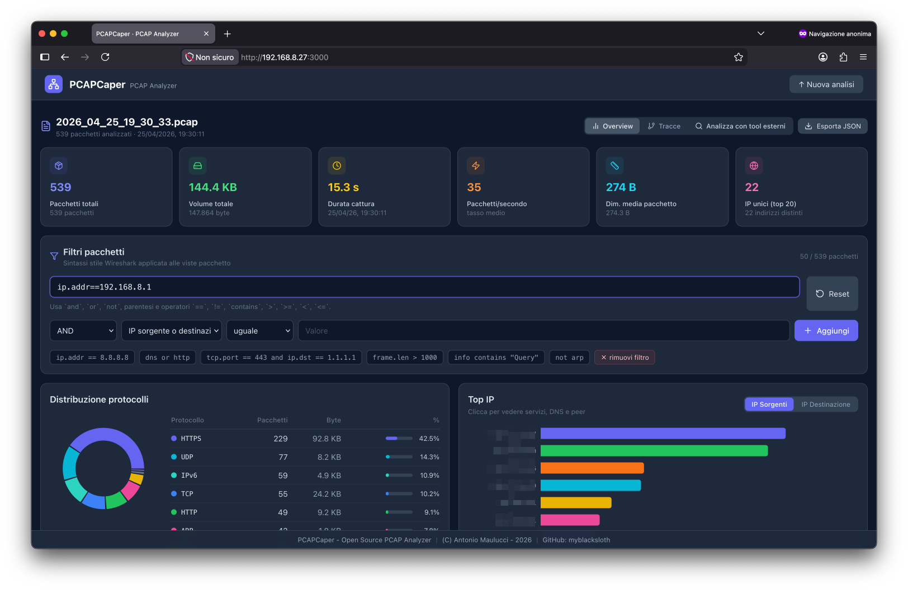

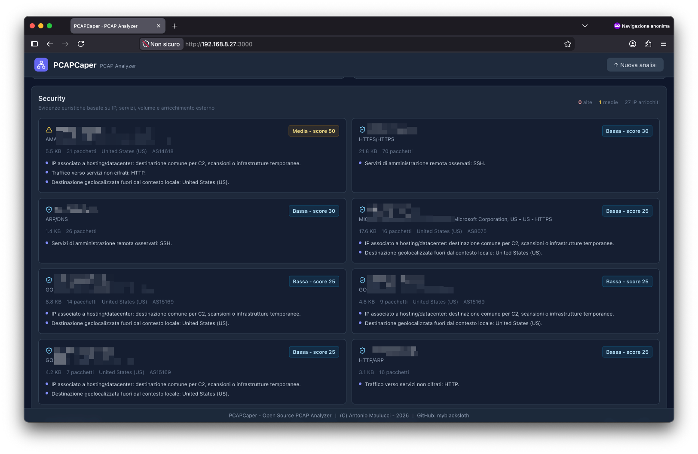

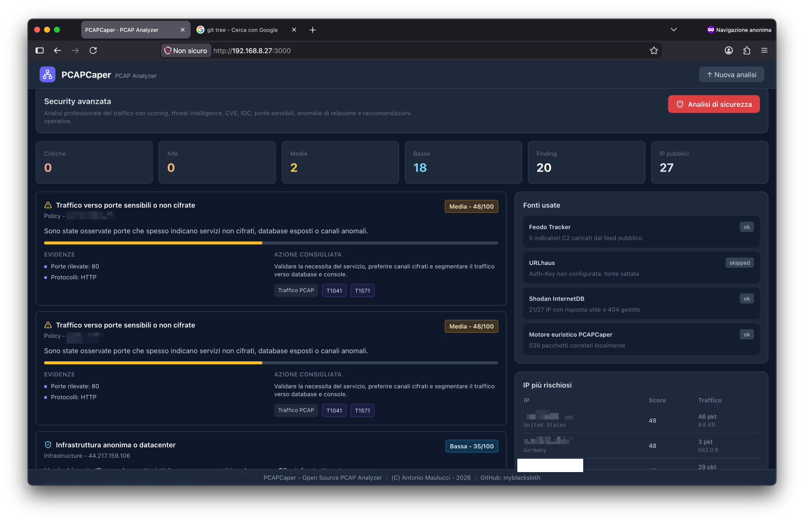

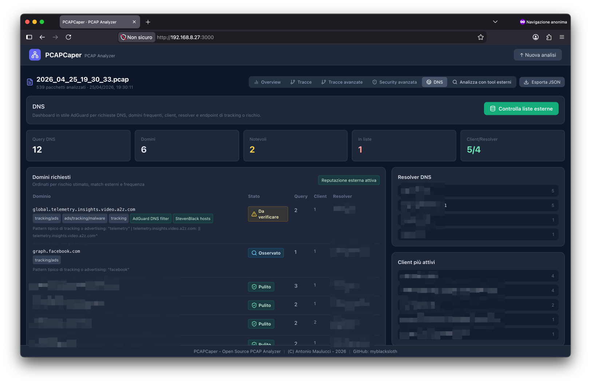

<!--

-->


**PCAPCaper** is an open source PCAP/PCAPNG/CAP analyzer with a modern web interface.

Upload a network capture and quickly inspect protocols, IP addresses, ports, conversations, DNS, HTTP, TLS, traffic timelines, packet filters, external IP enrichment, geolocation maps, advanced packet correlation, host profiles, network graphs, and security findings.

> Inspired by [apackets.com](https://apackets.com/), but fully open source and self-hostable.

---

## Table of contents

- [Main features](#main-features)
- [Screenshots](#screenshots)
- [Architecture](#architecture)
- [Technology stack](#technology-stack)
- [Analysis flow](#analysis-flow)
- [Local setup](#local-setup)
- [Docker setup](#docker-setup)
- [Configuration and performance](#configuration-and-performance)
- [Wireshark-style packet filters](#wireshark-style-packet-filters)
- [External IP enrichment](#external-ip-enrichment)
- [5-tuple flows and advanced traces](#5-tuple-flows-and-advanced-traces)
- [Security analysis](#security-analysis)
- [DNS analysis](#dns-analysis)
- [HTTP analysis](#http-analysis)
- [TLS analysis](#tls-analysis)
- [Hosts](#hosts)
- [Network graph](#network-graph)
- [API reference](#api-reference)
- [Project structure](#project-structure)
- [Contributing](#contributing)
- [License](#license)

---

## Main features

| Section | Details |
| --- | --- |
| **Overview** | Total packets, bytes, capture duration, packets per second, and average packet size. |
| **Protocols** | Donut chart and percentage table for the top protocols. |
| **Top IPs** | Most active source and destination IPs, service details popup, DNS data, peers, and optional external enrichment. |
| **Top ports** | Most used TCP/UDP source and destination ports with service names. |
| **Conversations** | Bidirectional IP-to-IP conversations sortable by packets or bytes. |
| **Packet filters** | Wireshark-style syntax plus GUI controls for quick filtering. |
| **Hosts** | Collapsible IP detail view with role, flows, DNS, HTTP/SNI, ASN/geo, findings, and activity timeline. |
| **Network graph** | Host-to-host graph based on 5-tuple flows, with finding-aware node colors. |
| **DNS** | AdGuard-style DNS dashboard with queries, answers, rcodes, TTLs, suspicious TXT records, tunneling indicators, and optional reputation checks. |
| **HTTP analysis** | Cleartext HTTP metadata extraction: requests, correlated responses, hosts, user agents, and status codes. |
| **TLS analysis** | Observable TLS metadata: SNI, version, cipher, ALPN, certificates, fingerprints, JA3/JA3S, and anomalies. |
| **External IP enrichment** | RDAP/IANA, Team Cymru ASN, reverse DNS, and GeoIP, only after explicit user confirmation. |
| **Security** | Heuristic findings for proxy/VPN, hosting, sensitive ports, cleartext services, and abnormal traffic volumes. |
| **Advanced security** | Dedicated opt-in tab with threat intelligence, CVEs, IOCs, scoring, evidence, and recommendations. |
| **IP traffic map** | World map colored by geolocated destination IP traffic; country click opens related flows. |
| **Advanced traces** | Flow tree with correlated packets, responses, and ACKs, based on backend 5-tuple flows. |
| **Timeline** | Area chart of traffic over time with adaptive buckets. |
| **Packet list** | Paginated packet details; the backend JSON limit is configurable through `PCAPCAPER_MAX_PACKET_LIST`. |
| **JSON export** | Download the complete analysis result as JSON. |

Supported formats: `.pcap`, `.pcapng`, `.cap`.

There is no default application-level upload limit. Operational limits can be configured through `.env`.

---

## Privacy model

PCAPCaper is privacy-by-default. Standard analysis is local to the uploaded capture.

Features that contact external services, such as IP enrichment, DNS reputation, and advanced threat intelligence, are opt-in and show a confirmation popup before any public IP address, domain, or traffic metadata is sent.

Private, local, multicast, reserved, and otherwise non-global IP addresses are filtered out before external enrichment.

---

## Screenshots

### IP address details

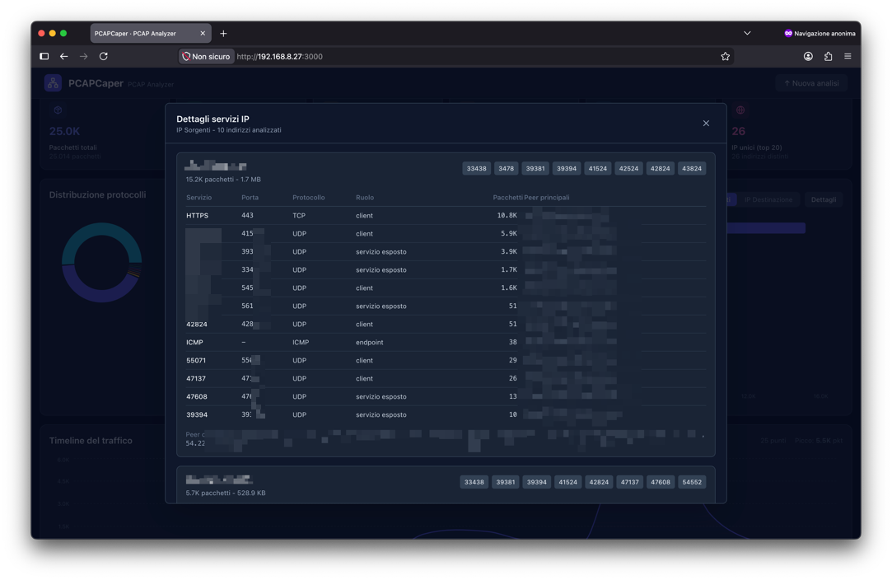

### IP address analysis service

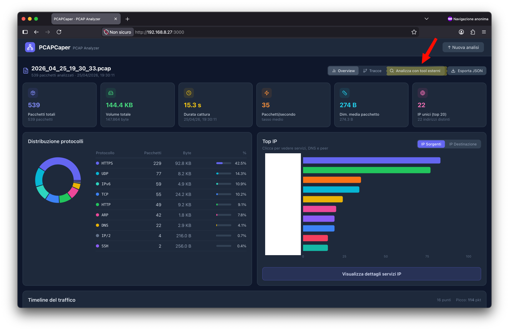
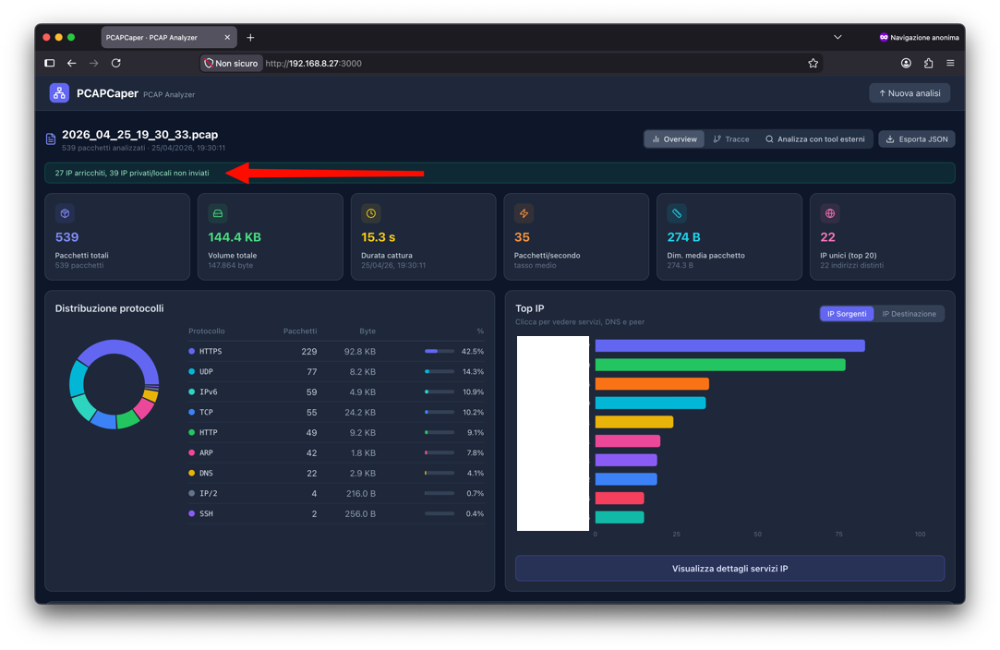
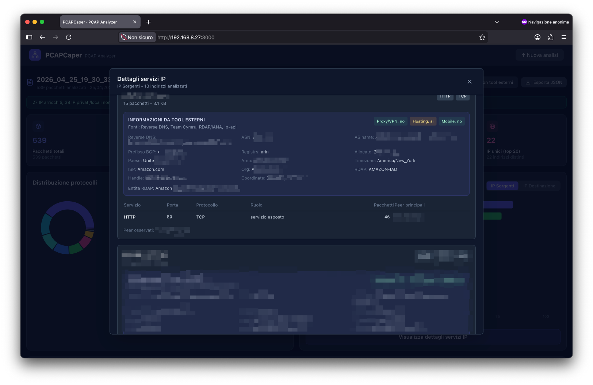

### IP traffic map

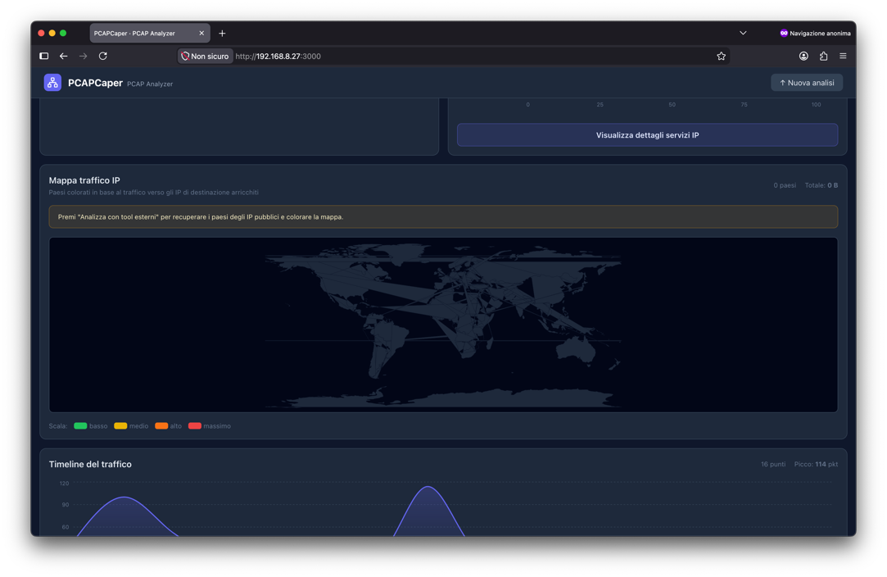

The **IP traffic map** uses public IP geolocation enrichment to color countries based on observed traffic.

Clicking a colored country opens a popup with:

- geolocated IPs in that country;
- 5-tuple flows involving those IPs;
- source and destination endpoints;
- protocol, state, bytes, and packets for each flow;
- traffic share attributed to the country.

### Advanced packet tracing

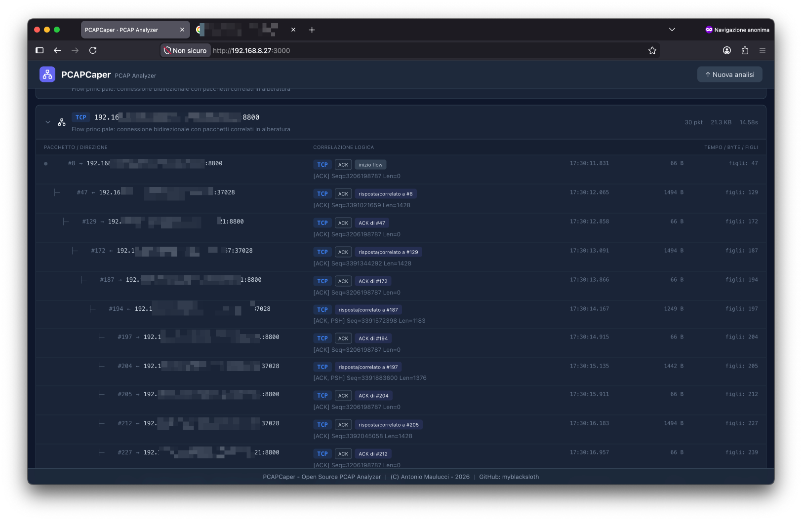

### Confirmation before sending data to external services

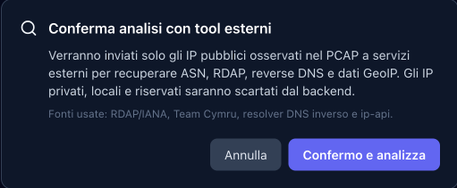

### Security report tab

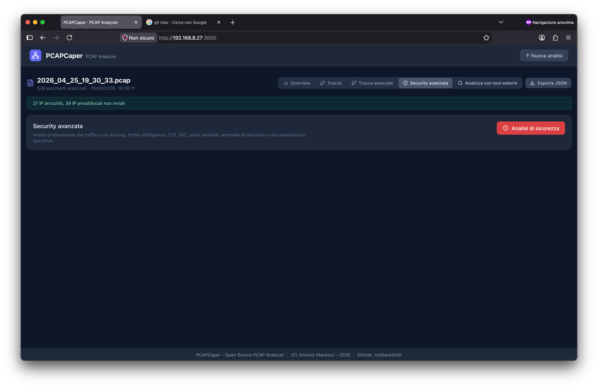

### DNS analysis

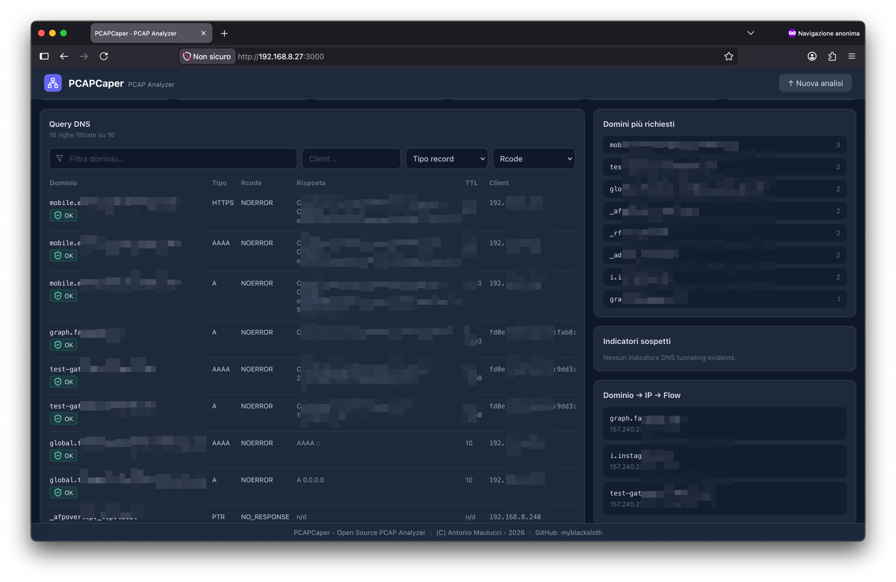

### HTTP analysis

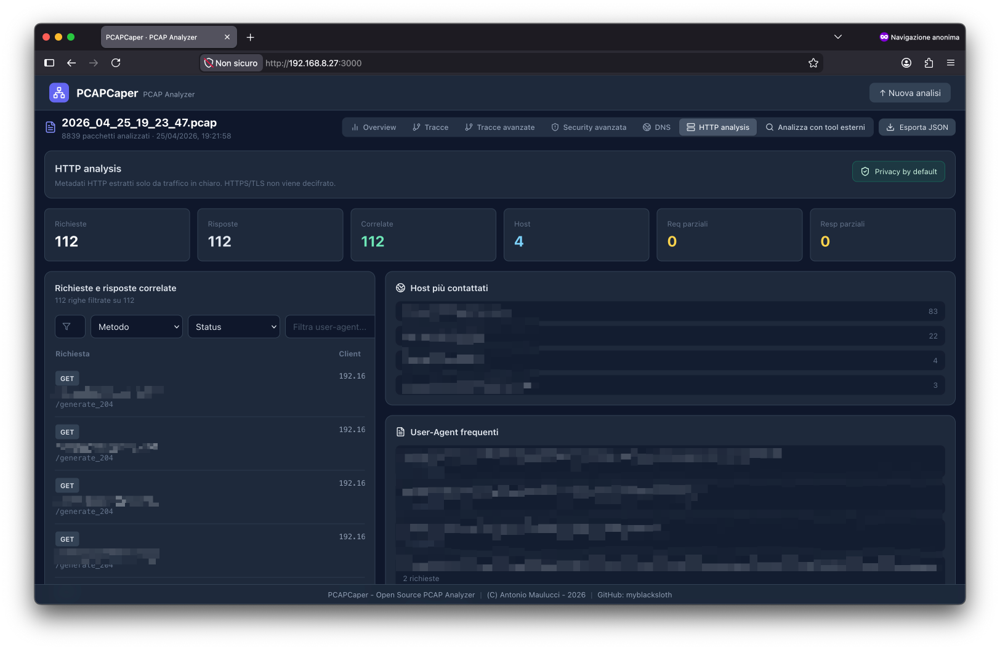

### TLS analysis

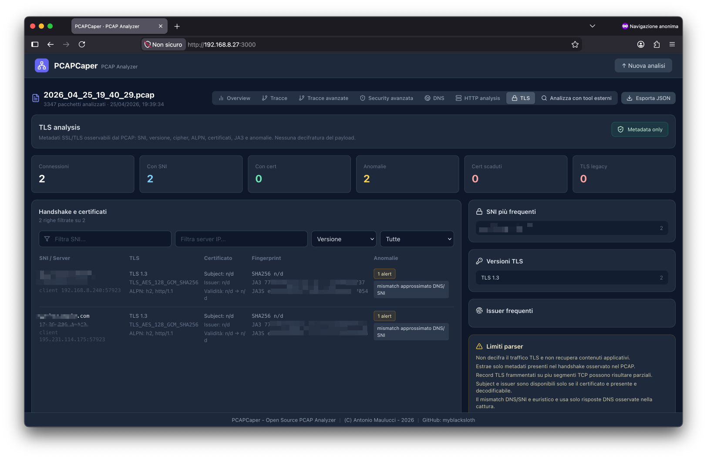

### Host classification

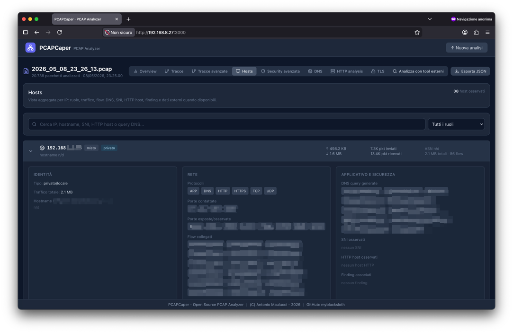

### Flow state analysis

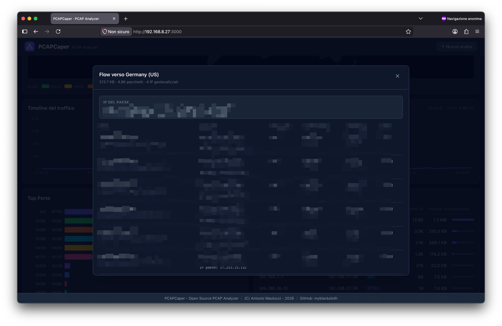

---

## Architecture

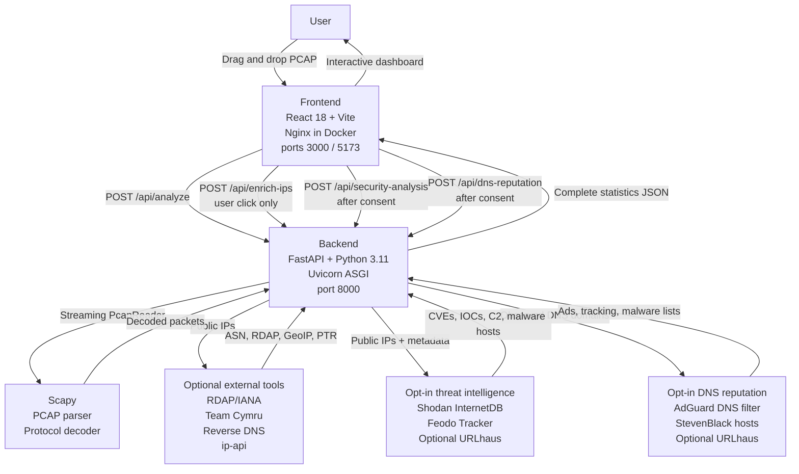
```mermaid
graph TB
    U["User"]
    FE["Frontend\nReact 18 + Vite\nNginx in Docker\nports 3000 / 5173"]
    BE["Backend\nFastAPI + Python 3.11\nUvicorn ASGI\nport 8000"]
    SC["Scapy\nPCAP parser\nProtocol decoder"]
    EXT["Optional external tools\nRDAP/IANA\nTeam Cymru\nReverse DNS\nip-api"]
    SECEXT["Opt-in threat intelligence\nShodan InternetDB\nFeodo Tracker\nOptional URLhaus"]
    DNSEXT["Opt-in DNS reputation\nAdGuard DNS filter\nStevenBlack hosts\nOptional URLhaus"]

    U -->|"Drag and drop PCAP"| FE
    FE -->|"POST /api/analyze"| BE
    FE -->|"POST /api/enrich-ips\nuser click only"| BE
    FE -->|"POST /api/security-analysis\nafter consent"| BE
    FE -->|"POST /api/dns-reputation\nafter consent"| BE
    BE -->|"Streaming PcapReader"| SC
    BE -->|"Public IPs"| EXT
    BE -->|"Public IPs + metadata"| SECEXT
    BE -->|"Observed DNS domains"| DNSEXT
    EXT -->|"ASN, RDAP, GeoIP, PTR"| BE
    SECEXT -->|"CVEs, IOCs, C2, malware hosts"| BE
    DNSEXT -->|"Ads, tracking, malware lists"| BE
    SC -->|"Decoded packets"| BE
    BE -->|"Complete statistics JSON"| FE
    FE -->|"Interactive dashboard"| U
```

---

## Technology stack

### Backend

| Technology | Version | Role |
| --- | --- | --- |
| Python | 3.11 | Runtime |
| FastAPI | 0.115 | REST API framework |
| Scapy | 2.6 | PCAP reading and decoding |
| Uvicorn | 0.34 | ASGI server |
| Pydantic | v2 | Data validation and serialization |

### Frontend

| Technology | Version | Role |
| --- | --- | --- |
| React | 18 | UI framework |
| TypeScript | 5.5 | Type safety |
| Vite | 5 | Build tool and development server |
| Tailwind CSS | 3.4 | Utility-first CSS |
| Recharts | 2.12 | Charts |
| Lucide React | — | SVG icons |

### Infrastructure

| Technology | Role |
| --- | --- |
| Docker + Docker Compose | Containerization |
| Nginx 1.27 | Frontend serving and API proxy |

---

## Analysis flow

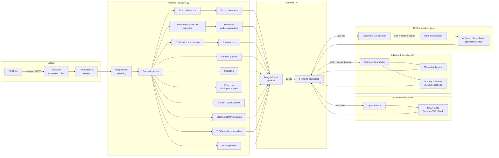
```mermaid
flowchart LR
    subgraph Upload
        A["PCAP file"] -->|"multipart POST"| B["Validation\nextension + size"]
        B --> C["Temporary file\nstorage"]
    end

    subgraph "Analysis - analyzer.py"
        C --> D["PcapReader\nstreaming"]
        D --> E["For each packet"]
        E --> F["Protocol detection"]
        E --> G["Source/destination IP extraction"]
        E --> H["TCP/UDP port extraction"]
        F --> I["Protocol counters"]
        G --> J["IP counters\nand conversations"]
        H --> K["Port counters"]
        E --> L["Timeline buckets"]
        E --> M["Packet list"]
        E --> Q["IP services\nDNS, peers, ports"]
        E --> Z["5-tuple TCP/UDP flows"]
        E --> HT["Cleartext HTTP metadata"]
        E --> TLS["TLS handshake metadata"]
        E --> HOSTS["Host/IP profiles"]
    end

    subgraph Aggregation
        I & J & K & L & M & Q & Z & HT & TLS & HOSTS --> N["AnalysisResult\nPydantic"]
        N -->|"JSON"| O["Frontend dashboard"]
    end

    subgraph "Optional enrichment"
        O -->|"user click"| P["/api/enrich-ips"]
        P --> R["RDAP, ASN,\nReverse DNS, GeoIP"]
        R --> O
    end

    subgraph "Advanced security opt-in"
        O -->|"click + consent popup"| S["/api/security-analysis"]
        S --> T["Threat intelligence"]
        S --> U["Scoring, evidence,\nrecommendations"]
        T & U --> O
    end

    subgraph "DNS reputation opt-in"
        O -->|"DNS tab"| V["Local DNS classification"]
        V -->|"click + consent popup"| W["/api/dns-reputation"]
        W --> X["AdGuard, StevenBlack,\noptional URLhaus"]
        X --> O
    end
```

---

## Local setup

### Requirements

- Python **3.11** or newer
- Node.js **20** or newer
- `pip` and `npm`
- macOS: `brew install libpcap` for Scapy support
- Debian/Ubuntu: `sudo apt-get install libpcap-dev`

### 1. Clone the repository

```bash
git clone https://github.com/myblacksloth/aPCAPerX.git
cd aPCAPerX
```

### 2. Start the backend

```bash
cd backend

python -m venv .venv
source .venv/bin/activate          # Linux/macOS
# .venv\Scripts\activate          # Windows

pip install -r requirements.txt
uvicorn main:app --reload --host 0.0.0.0 --port 8000
```

The backend is available at `http://localhost:8000`.

Interactive API documentation is available at `http://localhost:8000/docs`.

### 3. Start the frontend

Open a new terminal:

```bash
cd frontend
npm install
npm run dev
```

The frontend is available at `http://localhost:5173`.

> Vite automatically proxies `/api/*` requests to `localhost:8000`, so no manual configuration is required for local development.

---

## Docker setup

### Requirements

- Docker **24+**
- Docker Compose **v2**

### Start the full stack

```bash
git clone https://github.com/myblacksloth/aPCAPerX.git
cd aPCAPerX

docker compose up --build
```

Open `http://localhost:3000` in your browser.

### Useful commands

```bash
# Start in detached mode
docker compose up --build -d

# Follow logs
docker compose logs -f

# Stop containers without removing them
docker compose stop

# Stop and remove containers and networks
docker compose down

# Rebuild only the backend
docker compose up --build backend
```

### Exposed ports

| Service | Host port | Container port | Notes |
| --- | --- | --- | --- |
| Frontend | 3000 | 80 | Web interface |
| Backend | 8000 | 8000 | REST API, mostly for debugging |

---

## Configuration and performance

PCAP analysis is optimized to reduce memory usage and avoid blocking the server:

- uploads are written to temporary storage in chunks;
- the old 100 MB application-level upload limit has been removed;
- PCAP analysis runs in a separate thread from the FastAPI event loop;
- packet details and per-flow packet numbers are limited through configuration to avoid huge JSON responses;
- external IP enrichment is parallelized with a bounded number of workers;
- external DNS lists are downloaded and indexed with process-level caching;
- the UI has separate states for upload, processing, analysis, and external calls.

### `.env` variables

The repository includes `.env.example`. Local `.env` files are ignored by git and can be used to customize the environment.

| Variable | Default | Description |
| --- | --- | --- |
| `PCAPCAPER_UPLOAD_MAX_MB` | `0` | Upload limit in MB. `0` means no application-level limit. |
| `PCAPCAPER_TEMP_DIR` | `/tmp/pcapcaper` | Temporary PCAP file directory. |
| `PCAPCAPER_UPLOAD_CHUNK_SIZE` | `1048576` | Upload chunk size in bytes. |
| `PCAPCAPER_MAX_PACKET_LIST` | `1000` | Maximum detailed packet rows included in the JSON response. `0` means unlimited. |
| `PCAPCAPER_MAX_FLOW_PACKET_NUMBERS` | `200` | Maximum packet numbers stored per flow. `0` means unlimited. |
| `PCAPCAPER_EXTERNAL_MAX_WORKERS` | `6` | Maximum parallel workers for external enrichment. |
| `PCAPCAPER_MAX_ENRICHMENT_IPS` | `80` | Maximum public IPs enriched per request. |
| `PCAPCAPER_HTTP_TIMEOUT_SECONDS` | `6` | HTTP timeout for external services. |
| `PCAPCAPER_SOCKET_TIMEOUT_SECONDS` | `5` | Socket timeout for WHOIS and reverse lookup operations. |
| `URLHAUS_AUTH_KEY` | empty | Optional URLhaus Auth-Key. |

### Temporary storage

During `/api/analyze`, the backend stores the uploaded PCAP in `PCAPCAPER_TEMP_DIR` using `tempfile.NamedTemporaryFile(delete=False)`.

The file is removed in the endpoint `finally` block, including error cases. In Docker, `/tmp/pcapcaper` is mounted as `tmpfs`, so files are also removed when the container stops.

Redis was evaluated but is not required by the current synchronous request model. It remains a natural candidate for future asynchronous jobs, resumable analysis, shared progress state, and longer-lived result caching.

### Pagination and JSON limits

The packet list in the frontend is paginated with 50 rows per page.

By default, the backend sends the first `PCAPCAPER_MAX_PACKET_LIST=1000` detailed packets. Summaries, flows, DNS, HTTP, TLS, and hosts are still computed over the full PCAP.

Increasing this value for very large PCAP files makes the JSON heavier and may slow down the browser.

---

## Wireshark-style packet filters

The dashboard includes a **Packet filters** tab applied to the packet list and trace views. Main statistical summaries remain computed over the full PCAP, while packet-oriented views show only matching items.

You can use both the text input and GUI controls to build filters.

### Logical operators

| Operator | Description | Example |
| --- | --- | --- |
| `and` / `&&` | Both conditions must be true. | `dns and ip.dst == 8.8.8.8` |
| `or` / `||` | At least one condition must be true. | `http or https` |
| `not` / `!` | Negates a condition. | `not arp` |
| `( ... )` | Groups conditions. | `(dns or http) and frame.len > 100` |

### Comparison operators

| Operator | Description | Example |
| --- | --- | --- |
| `==` | Equal to. | `tcp.port == 443` |
| `!=` | Different from. | `ip.src != 192.168.1.10` |
| `contains` | Text field contains a string. | `info contains "Query"` |
| `>` | Greater than. | `frame.len > 1000` |
| `>=` | Greater than or equal to. | `frame.number >= 500` |
| `<` | Less than. | `frame.len < 128` |
| `<=` | Less than or equal to. | `frame.number <= 100` |

### Supported fields

| Field | Aliases | Description |
| --- | --- | --- |
| `ip.addr` | `ip` | Source or destination IP. |
| `ip.src` | `src`, `src.ip` | Source IP. |
| `ip.dst` | `dst`, `dst.ip` | Destination IP. |
| `tcp.port` | `port` | Source or destination TCP port. |
| `udp.port` | `port` | Source or destination UDP port. |
| `tcp.srcport` | `udp.srcport`, `src.port` | Source port. |
| `tcp.dstport` | `udp.dstport`, `dst.port` | Destination port. |
| `frame.len` | `len`, `length` | Packet length in bytes. |
| `frame.number` | `number`, `no` | Packet number. |
| `frame.time` | `time` | Timestamp shown in the packet table. |
| `protocol` | `proto` | Detected protocol. |
| `info` | — | Packet information field. |

### Quick protocol filters

You can write protocol names directly, without a field or operator.

| Filter | Meaning |
| --- | --- |
| `ip` | IP, IPv4, or IPv6 packets. |
| `tcp` | TCP packets. |
| `udp` | UDP packets. |
| `dns` | DNS or mDNS packets. |
| `http` | HTTP or HTTP-Alt traffic. |
| `https` | HTTPS or HTTPS-Alt traffic. |
| `tls` | Traffic classified as HTTPS/TLS. |
| `arp` | ARP packets. |
| `icmp` | ICMP packets. |
| `ssh` | SSH traffic. |

### Useful examples

```text
ip.addr == 8.8.8.8
ip.src == 192.168.1.10 and dns
tcp.port == 443
udp.dstport == 53
frame.len > 1000
info contains "Query"
(http or https) and not ip.dst == 192.168.1.1
```

---

## External IP enrichment

The **Analyze with external tools** button first shows a consent popup, then sends observed public IPs to the backend and collects additional information from multiple sources.

| Source | Data retrieved |
| --- | --- |
| RDAP/IANA | Registry, IP range, handle, resource name, entities, and RDAP notes. |
| Team Cymru | ASN, BGP prefix, registry, country code, and AS name. |
| Reverse DNS | PTR name associated with the IP address. |
| ip-api | Country, region, city, ISP, organization, timezone, proxy/VPN, mobile, and hosting flags. |

Private, local, multicast, reserved, and otherwise non-global addresses are discarded and are **not sent to external services**.

Enrichment is opt-in and only runs after the user confirms the dedicated popup.

Results are used to:

- enrich the **Top IPs** popup;
- color the **IP traffic map** and show related flows by country;
- feed the **Security** panel;
- provide context to the **Advanced security** tab;
- include external information in the JSON export.

---

## 5-tuple flows and advanced traces

The backend reconstructs true 5-tuple TCP/UDP flows while streaming the PCAP.

Each flow is identified by the first observed direction:

```text
src_ip, src_port, dst_ip, dst_port, L4 protocol
```

Packets in the reverse direction are associated with the same flow through a bidirectional key, while the JSON keeps the original 5-tuple and a stable `flow_id`.

For each item in `flows`, PCAPCaper computes:

- `flow_id`;
- source IP and port;
- destination IP and port;
- L4 protocol;
- first and last timestamp;
- duration;
- total packets and bytes;
- client-to-server packets and bytes;
- server-to-client packets and bytes;
- aggregated TCP flags;
- approximate state, such as `opening`, `established`, `closing`, `closed`, `reset`, `request_response`, or `one_way`;
- packet numbers that belong to the flow.

The **Advanced traces** tab uses these data to show the flow ID, backend-computed state, and directional counters at the roots of the trace tree. Visual packet-response-ACK correlation remains available as a navigable tree.

---

## Security analysis

The **Security** panel reports potentially risky connections using locally collected data and optional external enrichment.

Findings are heuristic and do not replace dedicated threat intelligence feeds or blacklists.

Current rules consider:

- IPs reported as proxy/VPN;
- IPs associated with hosting or datacenters;
- traffic to cleartext services such as HTTP, FTP, Telnet, SMTP, POP3, and IMAP;
- remote administration services such as SSH, RDP, VNC, SMB, and Telnet;
- database services such as MySQL, PostgreSQL, Redis, MongoDB, MSSQL, and Oracle;
- sensitive ports;
- high traffic volume compared with other destinations;
- destinations geolocated outside the local context.

Each finding shows IP, severity, score, ASN/country when available, traffic volume, packets, and concrete reasons.

### Advanced security

The **Advanced security** tab runs a deeper triage-oriented analysis. To reduce CPU usage and avoid unwanted external requests, the workflow is explicit:

1. upload and analyze the PCAP;
2. click **Analyze with external tools** to enrich IPs;
3. open **Advanced security**;
4. click **Security analysis**;
5. confirm the popup explaining which external services may be used.

Only after confirmation are threat intelligence services called.

### Sources and data used

| Source | Requirements | Data used |
| --- | --- | --- |
| Shodan InternetDB | No API key | Exposed ports, CPEs, tags, hostnames, and CVEs associated with the IP. |
| Feodo Tracker | No API key | Botnet C2 indicators from the public JSON feed. |
| URLhaus | Backend variable `URLHAUS_AUTH_KEY` | Hosts associated with malware distribution URLs. |
| Local PCAPCaper engine | None | Peers, ports, protocols, volumes, fan-out, and packet samples. |
| Previous IP enrichment | Click on **Analyze with external tools** | ASN, country, proxy/VPN, hosting/datacenter, and reverse DNS. |

### Tab output

The tab shows:

- severity counters: critical, high, medium, low;
- findings sorted by risk;
- 0-100 score and confidence;
- concrete evidence from packets and external sources;
- operational recommendations for triage, containment, or verification;
- MITRE ATT&CK references when relevant;
- status of used sources and non-blocking errors;
- ranking of the riskiest IPs.

### Privacy and control

The `/api/security-analysis` call is opt-in. The popup informs the user before sending data to third-party services.

The backend only uses public IP addresses for external lookups. Private, local, and reserved IPs are not used for threat intelligence queries.

To enable URLhaus:

```bash
export URLHAUS_AUTH_KEY="your-auth-key"
uvicorn main:app --reload --host 0.0.0.0 --port 8000
```

Without `URLHAUS_AUTH_KEY`, URLhaus is shown as `skipped` and analysis continues with the other sources.

---

## DNS analysis

The **DNS** tab is dedicated to DNS requests observed in the PCAP. The view is AdGuard-inspired and provides immediate summaries, top domains, most active clients, resolvers, and tracking, advertising, or risk indicators.

### Local analysis

Without sending data outside, the backend produces a `dns` section in the analysis JSON.

The tab:

- extracts DNS queries, record types, and transaction IDs;
- correlates responses with queries when possible;
- shows response codes such as `NOERROR`, `NXDOMAIN`, `SERVFAIL`, and `REFUSED`;
- shows answers and TTLs when available;
- identifies requesting clients and queried resolvers;
- aggregates top domains, top clients, and top resolvers;
- calculates the NXDOMAIN ratio;
- flags suspicious TXT queries;
- highlights possible DNS tunneling indicators, such as very long labels, many unique subdomains, high approximate entropy, and abnormal volume toward the same domain;
- correlates domain → answer IP → later flows when the returned IP appears in the 5-tuple flows.

The view includes filters by domain, client, record type, and rcode.

### External list checks

The **Check external lists** button shows a consent popup before any external request.

After confirmation, the backend checks domains against:

| Source | Requirements | Data used |
| --- | --- | --- |
| AdGuard DNS filter | No API key | DNS-level rules for ads, tracking, cryptomining, and malicious domains. |
| StevenBlack hosts | No API key | Aggregated hosts list for ads, tracking, and malware. |
| URLhaus | Backend variable `URLHAUS_AUTH_KEY` | Hosts associated with malware distribution URLs. |

The response shows used sources, download status, non-blocking errors, categories, and rules that produced matches.

### DNS privacy

Local DNS analysis is privacy-by-default: it only uses the uploaded PCAP and does not send domains to external services.

External DNS reputation is opt-in. No domain is sent to external services during PCAP upload or standard analysis. Sending happens only from the **DNS** tab, after explicit user confirmation.

---

## HTTP analysis

The **HTTP analysis** tab shows HTTP metadata extracted only from cleartext traffic. It does not decrypt HTTPS/TLS and does not send data to external services.

For HTTP requests, PCAPCaper extracts, when available:

- timestamp;
- client IP and port;
- server IP and port;
- method;
- host;
- URI/path;
- user-agent;
- referer;
- content-type;
- approximate payload size.

For HTTP responses, it extracts:

- status code;
- reason phrase;
- `Server` header;
- content-type;
- content-length;
- file name inferred from `Content-Disposition` or the request URI.

The tab includes:

- request table with correlated responses when possible;
- most contacted hosts;
- most frequent user agents;
- filters by host, method, status, and user-agent.

### HTTP limitations

The parser is conservative:

- it only analyzes TCP payloads that start as textual HTTP;
- it does not fully reconstruct TCP streams;
- fragmented headers or bodies may be marked as partial;
- payload size is estimated from `Content-Length` or from bytes present in the observed segment;
- encrypted HTTPS/TLS traffic is not interpreted.

---

## TLS analysis

The **TLS analysis** tab analyzes SSL/TLS using only observable metadata from handshake records present in the PCAP.

It does not decrypt traffic, does not require private keys, and does not show encrypted application content.

When available, it extracts:

- SNI from `ClientHello`;
- offered or negotiated TLS version;
- cipher suite negotiated in `ServerHello`;
- advertised or negotiated ALPN;
- subject and issuer of the leaf certificate;
- certificate validity period;
- SHA256 fingerprint of the DER certificate;
- JA3 and JA3S fingerprints when the required messages are complete;
- partial state when records or handshakes are fragmented.

The tab includes:

- TLS connections table with client, server, SNI, version, cipher, certificate, and fingerprint;
- filters by SNI, server IP, version, and anomaly presence;
- summaries of most frequent SNI values, TLS versions, and certificate issuers;
- parser limitation panel to clearly separate what is observable from what is not.

### TLS anomalies

Anomalies are heuristic and based only on available metadata:

- certificate expired at the capture timestamp;
- certificate not yet valid;
- self-signed certificate;
- missing SNI;
- legacy TLS, such as `SSL 3.0`, `TLS 1.0`, or `TLS 1.1`;
- approximate mismatch between DNS observed in the PCAP and SNI, when both are available.

### TLS limitations

The TLS parser is intentionally conservative:

- it does not decrypt TLS payloads and does not recover URLs, HTTP headers, or encrypted content;
- it does not fully reconstruct TCP streams;
- TLS records fragmented across multiple segments may be marked as partial;
- subject and issuer are available only if the certificate is present in the PCAP and can be decoded by the Python standard library;
- DNS/SNI mismatch uses only DNS responses seen in the capture, so false positives may occur if DNS is absent, cached, or resolved outside the capture.

---

## Hosts

The **Hosts** tab shows a detail view for each IP observed in the PCAP. Sections are collapsible and closed by default. IPs in the packet list are clickable and open the **Hosts** tab filtered on that address.

For each host, PCAPCaper shows:

- estimated role: `client`, `server`, `mixed`, or `unknown`;
- private/public classification;
- hostnames inferred from DNS observed in the PCAP and reverse DNS from external tools when available;
- ASN, organization, and geolocation if IP enrichment was enabled by the user;
- used protocols;
- contacted remote ports;
- exposed or observed server-side ports;
- sent and received bytes and packets;
- related flows;
- generated DNS queries;
- observed TLS SNI values and HTTP hosts;
- associated findings, such as cleartext HTTP or TLS anomalies;
- activity timeline with sent and received bytes per time bucket.

The `hosts` section is computed by the backend during standard analysis and does not send data to external services.

ASN/geo data are only displayed when already present in `external_ip_info`, after user consent through **Analyze with external tools**.

---

## Network graph

The **Graph** tab shows a host-to-host representation built from backend-computed 5-tuple flows.

Main characteristics:

- each node represents an IP/host;
- each edge aggregates one or more flows between two hosts;
- edge thickness can be based on bytes or packets;
- node color highlights internal/external hosts and finding presence;
- for very large captures, the graph is limited to the heaviest flows to keep the UI responsive.

Available filters:

- flow protocol;
- internal, external, or internal ↔ external communications;
- finding severity inferred from available evidence;
- weight metric: bytes or packets.

Interactions:

- click on a node to show host summary, traffic, protocols, related flows, and findings;
- click on an edge to show underlying flows, endpoints, traffic, packets, and flow state.

The view is implemented in SVG without adding new frontend dependencies.

---

## API reference

### `GET /api/health`

Checks whether the backend is running.

**Response:**

```json
{
  "status": "ok",
  "service": "pcap-analyzer"
}
```

---

### `POST /api/analyze`

Analyzes a PCAP file and returns the report.

**Request:** `Content-Type: multipart/form-data`

| Field | Type | Description |
| --- | --- | --- |
| `file` | File | `.pcap`, `.pcapng`, or `.cap` file. Application-level size limit is configurable through `PCAPCAPER_UPLOAD_MAX_MB`. |

**Response sections include:**

- `filename`;
- `summary`;
- `protocols`;
- `top_src_ips`;
- `top_dst_ips`;
- `top_src_ports`;
- `top_dst_ports`;
- `conversations`;
- `flows`;
- `dns`;
- `http`;
- `tls`;
- `hosts`;
- `timeline`;
- `packets`;
- `external_ip_info`.

**Error responses:**

| Status code | Cause |
| --- | --- |
| `400` | Unsupported file extension or empty file. |
| `413` | File exceeds `PCAPCAPER_UPLOAD_MAX_MB`, when configured. |
| `422` | Corrupted PCAP file or no valid packets found. |
| `500` | Internal server error. |

---

### `POST /api/enrich-ips`

Enriches a list of public IPs using external tools. This endpoint is used by the **Analyze with external tools** button.

**Request:**

```json
{
  "ips": ["8.8.8.8", "1.1.1.1", "192.168.1.10"]
}
```

**Privacy note:** non-global IPs are discarded before any external call.

---

### `POST /api/security-analysis`

Runs advanced traffic security analysis. The endpoint is called by the **Advanced security** tab only after explicit user confirmation.

External sources include Shodan InternetDB, Feodo Tracker, and optional URLhaus with `URLHAUS_AUTH_KEY`.

---

### `POST /api/dns-reputation`

Checks observed DNS domains against open external lists. The endpoint is called by the **DNS** tab only after explicit user confirmation.

External sources include AdGuard DNS filter, StevenBlack hosts, and optional URLhaus with `URLHAUS_AUTH_KEY`.

---

## Project structure

```text
pcapcaper/
├── backend/
│   ├── main.py                  # FastAPI entry point: health, analyze, enrich-ips
│   ├── analyzer.py              # PCAP analysis engine based on Scapy
│   ├── flow_analysis.py         # TCP/UDP 5-tuple flow reconstruction
│   ├── dns_analysis.py          # Local DNS analysis
│   ├── http_analysis.py         # Cleartext HTTP analysis
│   ├── tls_analysis.py          # Metadata-only TLS analysis
│   ├── host_analysis.py         # Aggregated host/IP view
│   ├── external_enrichment.py   # Opt-in external IP enrichment
│   ├── security_analysis.py     # Advanced security and threat intelligence engine
│   ├── dns_intelligence.py      # Opt-in DNS reputation checks
│   ├── models.py                # Pydantic request/response models
│   ├── requirements.txt         # Python dependencies
│   └── Dockerfile               # Backend Docker image
├── frontend/
│   ├── src/
│   │   ├── main.tsx             # React entry point
│   │   ├── App.tsx              # Root component
│   │   ├── index.css            # Global styles and Tailwind
│   │   ├── types/
│   │   │   └── analysis.ts      # TypeScript analysis types
│   │   ├── utils/
│   │   │   ├── format.ts        # Formatting helpers
│   │   │   └── packetFilters.ts # Wireshark-style filter parser
│   │   └── components/          # UI components and dashboard views
│   ├── index.html
│   ├── package.json
│   ├── vite.config.ts           # Dev proxy: /api -> backend
│   ├── tailwind.config.js
│   ├── nginx.conf               # Nginx SPA serving and API proxy
│   └── Dockerfile               # Frontend Docker image
├── docker-compose.yml           # Two-container orchestration
└── README.md
```

---

## Contributing

1. Fork the repository.
2. Create a branch: `git checkout -b feature/your-feature-name`.
3. Commit your changes: `git commit -m "feat: description"`.
4. Push the branch: `git push origin feature/your-feature-name`.
5. Open a Pull Request.

Do not commit real PCAP files, credentials, payloads, or personal data.

Features that send data to external services must remain opt-in, visible to the user, and documented.

---

## License

GNU Affero General Public License v3.0 — see [LICENSE](LICENSE) for details.

---

*PCAPCaper - Open Source PCAP Analyzer*  
*(C) Antonio Maulucci - 2026*  
GitHub: [myblacksloth](https://github.com/myblacksloth)
