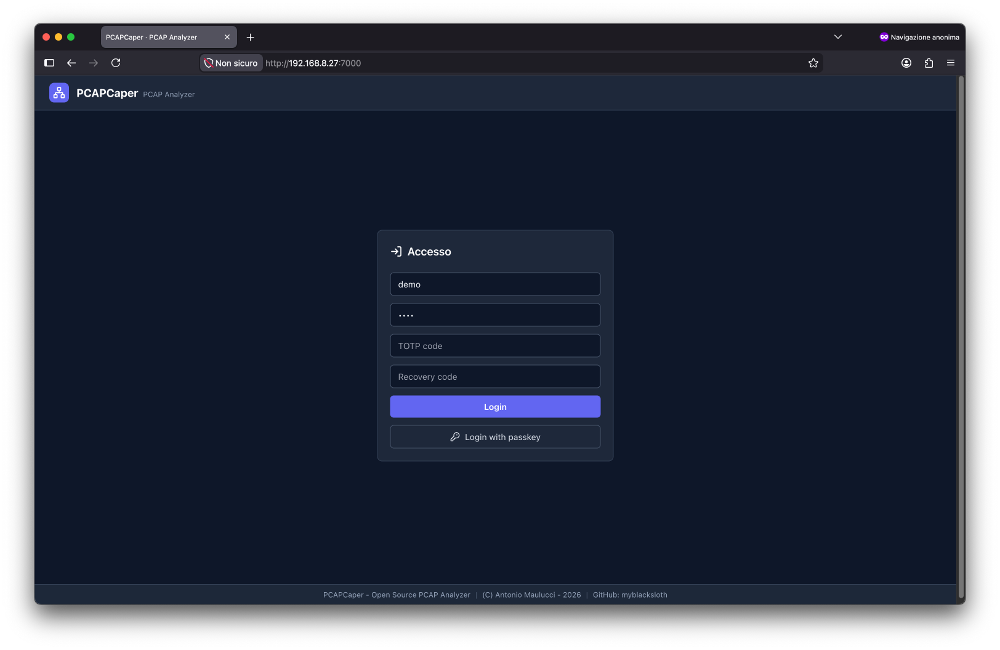
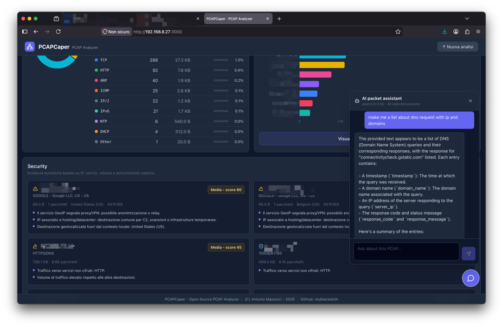

# PCAPCaper

**Open source PCAP analyzer with a modern web interface.**

Upload a network capture and instantly inspect protocols, IP addresses, ports, conversations, DNS, HTTP, TLS, traffic timelines, packet filters, follow-stream payloads, external IP enrichment, geolocation maps, advanced packet correlation, host profiles, network graphs, and security findings.

> Inspired by [apackets.com](https://apackets.com/), but fully open source and self-hostable.

---

## Gallery

| | | | |
|---|---|---|---|
|  |  |  |  |
|  |  |  | |

---

## Quick Start

### Docker (Recommended)

```bash
git clone https://github.com/myblacksloth/aPCAPerX.git
cd aPCAPerX
docker compose up --build
```

Open **`http://localhost:3000`** in your browser.

### Local Setup

```bash
# Backend
cd backend
python -m venv .venv && source .venv/bin/activate
pip install -r requirements.txt
uvicorn main:app --reload --host 0.0.0.0 --port 8000

# Frontend (new terminal)
cd frontend
npm install && npm run dev
```

Open **`http://localhost:5173`** in your browser.

For detailed setup instructions, see [Setup Guide](doc/SETUP.md).

---

## Features

| Feature | Description |
| --- | --- |
| **Protocol Analysis** | Donut chart and percentage table for detected protocols |
| **Conversations** | Bidirectional IP-to-IP flows with packet and byte counts |
| **Packet Filters** | Wireshark-style syntax + GUI builder |
| **Host Profiles** | IP details, DNS, HTTP/SNI, ASN/GeoIP, findings, and activity timeline |
| **Network Graph** | Host-to-host visualization based on 5-tuple flows |
| **DNS Analysis** | Query extraction, resolution tracking, and optional reputation checks |
| **HTTP Analysis** | Cleartext metadata extraction with request/response correlation |
| **TLS Analysis** | SNI, version, cipher, certificate, JA3/JA3S, and anomalies |
| **Follow Stream** | TCP/UDP payload reconstruction with client/server transcript |
| **IP Enrichment** | RDAP, ASN, reverse DNS, and GeoIP (opt-in, with user consent) |
| **Security Findings** | Heuristic rules for risky connections and threat intelligence (opt-in) |
| **IP Traffic Map** | World map colored by geolocated destination IP traffic |
| **Advanced Traces** | Flow tree with packet correlation and ACK tracking |
| **AI Chat** | Lightweight local assistant (Ollama) for technical analysis |

Supported formats: `.pcap`, `.pcapng`, `.cap`  
No default upload limit. Operational limits are configurable.

---

## Key Characteristics

### Privacy-by-Default

Standard analysis is **completely local** to your uploaded capture. Features that contact external services (IP enrichment, DNS reputation, threat intelligence) are **opt-in** and show a confirmation popup before any data is sent.

Private, local, multicast, and reserved IP addresses are **never** sent to external services.

### Performance Optimized

- Uploads are streamed to temporary storage in chunks
- PCAP analysis runs in a separate thread
- Packet details are paginated; summaries compute over the full capture
- External enrichment is parallelized with bounded workers
- JSON responses are limited by configuration to avoid browser slowdowns

### Light AI Assistant

Built-in chat powered by a local Ollama model (`qwen2.5:0.5b` by default):
- Docker limits to 1 CPU and 3 GB RAM
- No raw packet bytes sent to the model; only bounded technical evidence
- Timeout protection to prevent hanging

---

## Screenshots

| View | Feature |
| --- | --- |
|  | Dashboard overview with top IPs and protocol distribution |
|  | DNS queries, answers, and tunneling indicators |
|  | Cleartext HTTP requests and responses |
|  | TLS handshake metadata and certificate details |
|  | Geolocation map with traffic coloring by country |
|  | Advanced security findings with threat intel |
|  | Host-to-host network visualization |
|  | TCP/UDP payload reconstruction |

---

## Documentation

- **[Setup & Installation](doc/SETUP.md)** — Local and Docker setup instructions
- **[Architecture](doc/ARCHITECTURE.md)** — System design, tech stack, and analysis flow
- **[Features Guide](doc/FEATURES.md)** — Detailed feature descriptions
- **[Configuration](doc/CONFIGURATION.md)** — Environment variables and performance tuning
- **[AI Assistant](doc/AI.md)** — Ollama integration and configuration
- **[API Reference](doc/API.md)** — REST API endpoints and request/response formats
- **[Project Structure](doc/STRUCTURE.md)** — Codebase organization
- **[Development Guide](doc/DEVELOPMENT.md)** — Contributing guidelines and code style

---

## Configuration

Key environment variables:

| Variable | Default | Purpose |
| --- | --- | --- |
| `PCAPCAPER_UPLOAD_MAX_MB` | `0` | Upload limit (0 = unlimited) |
| `PCAPCAPER_MAX_PACKET_LIST` | `1000` | Max packet details in JSON |
| `PCAPCAPER_TEMP_DIR` | `/tmp/pcapcaper` | Temporary file storage |
| `PCAPCAPER_AI_ENABLED` | `1` | Enable local AI chat |
| `PCAPCAPER_AUTH_ENABLED` | `1` | Enable user accounts & authentication |

For all options, see [Configuration Guide](doc/CONFIGURATION.md).

---

## API

Key endpoints:

- `POST /api/analyze` — Upload and analyze a PCAP file
- `POST /api/enrich-ips` — Enrich IPs with external data (opt-in)
- `POST /api/security-analysis` — Run advanced security analysis (opt-in)
- `POST /api/dns-reputation` — Check DNS domains against reputation lists (opt-in)
- `POST /api/ai-chat` — Ask the AI assistant about the capture

For complete API reference, see [API Docs](doc/API.md).

---

## Development

### Contributing

Contributions are welcome! Please:

1. Fork the repository
2. Create a feature branch: `git checkout -b feature/your-feature`
3. Write clear, commented code in English
4. Update documentation if needed
5. Submit a pull request

See [Development Guide](doc/DEVELOPMENT.md) for detailed guidelines.

### Code Requirements

- ✅ Functional, tested code
- ✅ Clear English comments
- ✅ Updated `.env.example` if config changes
- ✅ No credentials, PCAP files, or personal data committed
- ✅ External features must be opt-in with user consent

---

## License

GNU Affero General Public License v3.0 — see [LICENSE](LICENSE) for details.

---

*PCAPCaper — Open Source PCAP Analyzer*  
*© 2026 — [myblacksloth](https://github.com/myblacksloth)*

**Available in:** [English](README.md) · [Italiano](README.ITA.md)
