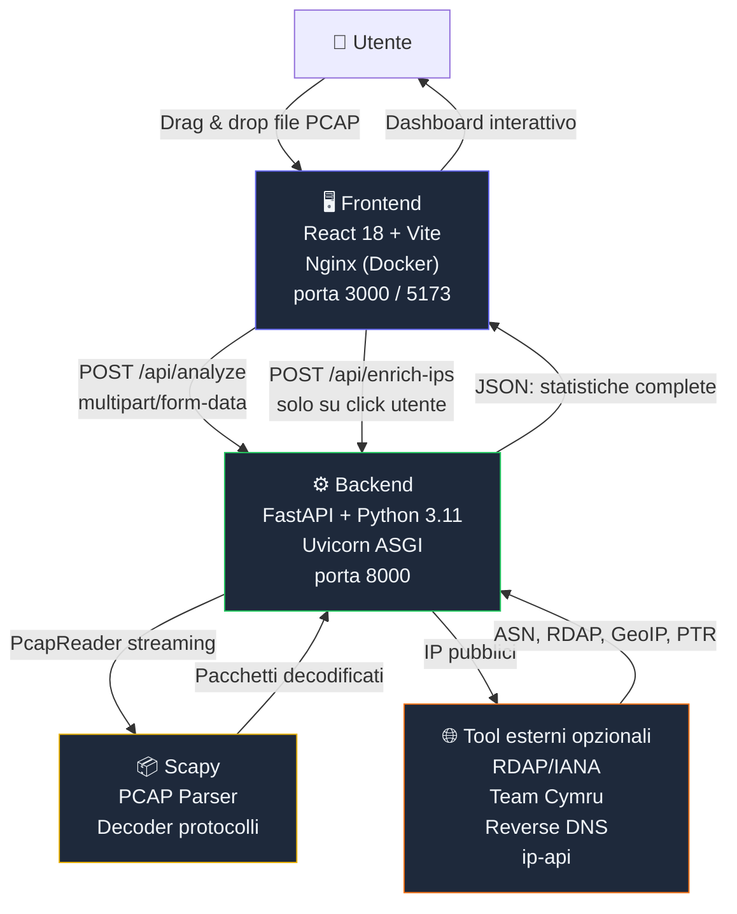
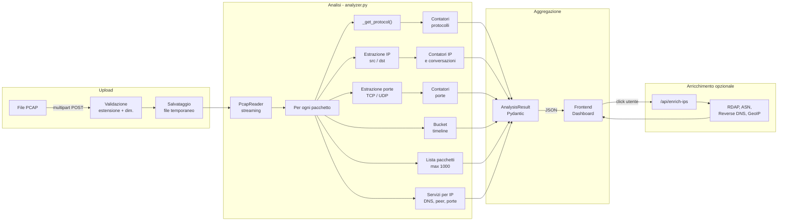
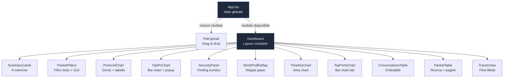

<!--

-->

# PCAPCaper 🔍

**PCAPCaper** è un analizzatore open source di file PCAP/PCAPNG con interfaccia web moderna.
Carica un file di cattura di rete e ottieni in secondi statistiche complete su protocolli, indirizzi IP, porte, conversazioni, timeline del traffico, filtri pacchetto, arricchimento IP esterno, mappa geografica e segnalazioni security euristiche.

> Ispirato a [apackets.com](https://apackets.com/), ma completamente open source e auto-ospitabile.

---

- [PCAPCaper 🔍](#pcapcaper-)
  - [✨ Funzionalità](#-funzionalità)
  - [Screenshot](#screenshot)
    - [Servizio di analisi degli indirizzi IP](#servizio-di-analisi-degli-indirizzi-ip)
    - [Mappa degli indirizzi IP](#mappa-degli-indirizzi-ip)
    - [Advanced packet tracing](#advanced-packet-tracing)
  - [🏗️ Architettura](#️-architettura)
  - [🧩 Stack tecnologico](#-stack-tecnologico)
    - [Backend](#backend)
    - [Frontend](#frontend)
    - [Infrastruttura](#infrastruttura)
  - [📊 Flusso di analisi](#-flusso-di-analisi)
  - [🚀 Avvio locale (senza Docker)](#-avvio-locale-senza-docker)
    - [Prerequisiti](#prerequisiti)
    - [1. Clona il repository](#1-clona-il-repository)
    - [2. Avvia il Backend](#2-avvia-il-backend)
    - [3. Avvia il Frontend](#3-avvia-il-frontend)
  - [🐳 Avvio con Docker](#-avvio-con-docker)
    - [Prerequisiti](#prerequisiti-1)
    - [Avvio completo](#avvio-completo)
    - [Comandi utili](#comandi-utili)
    - [Porte esposte](#porte-esposte)
  - [🔎 Filtri pacchetti stile Wireshark](#-filtri-pacchetti-stile-wireshark)
    - [Operatori logici](#operatori-logici)
    - [Operatori di confronto](#operatori-di-confronto)
    - [Campi supportati](#campi-supportati)
    - [Filtri protocollo rapidi](#filtri-protocollo-rapidi)
    - [Esempi utili](#esempi-utili)
  - [🛰️ Arricchimento IP esterno](#️-arricchimento-ip-esterno)
  - [🛡️ Security](#️-security)
  - [📡 API Reference](#-api-reference)
    - [`GET /api/health`](#get-apihealth)
    - [`POST /api/analyze`](#post-apianalyze)
    - [`POST /api/enrich-ips`](#post-apienrich-ips)
  - [📁 Struttura del progetto](#-struttura-del-progetto)
  - [🔄 Diagramma dei componenti frontend](#-diagramma-dei-componenti-frontend)
  - [🤝 Contribuire](#-contribuire)
  - [📄 Licenza](#-licenza)


---

## ✨ Funzionalità

| Sezione | Dettagli |
|---|---|
| **Riepilogo** | Pacchetti totali, byte, durata, pacchetti/sec, dimensione media |
| **Protocolli** | Distribuzione con grafico donut + tabella percentuali (top 20) |
| **Top IP** | Indirizzi sorgente/destinazione più attivi, popup dettagli servizi, DNS, peer e dati esterni |
| **Top Porte** | Porte TCP/UDP più usate con nome servizio (top 15 src + dst) |
| **Conversazioni** | Flussi bidirezionali IP↔IP ordinabili per pacchetti o byte (top 20) |
| **Filtri pacchetti** | Filtri stile Wireshark con input testuale e builder GUI |
| **Arricchimento IP esterno** | RDAP/IANA, Team Cymru ASN, reverse DNS e GeoIP su richiesta esplicita |
| **Security** | Segnalazioni euristiche su proxy/VPN, hosting, porte sensibili, servizi non cifrati e volumi anomali |
| **Mappa traffico IP** | Mappa mondiale con stati colorati in base al traffico verso IP geolocalizzati |
| **Timeline** | Area chart del traffico nel tempo con bucket adattivi |
| **Lista Pacchetti** | Primi 1000 pacchetti con ricerca full-text e paginazione |
| **Esporta JSON** | Scarica il risultato dell'analisi in formato JSON |

Formati supportati: `.pcap`, `.pcapng`, `.cap` · Limite dimensione: **100 MB**

---

## Screenshot

**dettaglio su indirizzi IP**


### Servizio di analisi degli indirizzi IP


### Mappa degli indirizzi IP


### Advanced packet tracing


<!--

-->

---

## 🏗️ Architettura



---

## 🧩 Stack tecnologico

### Backend
| Tecnologia | Versione | Ruolo |
|---|---|---|
| Python | 3.11 | Runtime |
| FastAPI | 0.115 | Framework REST API |
| Scapy | 2.6 | Lettura e decodifica PCAP |
| Uvicorn | 0.34 | Server ASGI |
| Pydantic | v2 | Validazione e serializzazione dati |

### Frontend
| Tecnologia | Versione | Ruolo |
|---|---|---|
| React | 18 | UI framework |
| TypeScript | 5.5 | Type safety |
| Vite | 5 | Build tool e dev server |
| Tailwind CSS | 3.4 | Utility-first CSS |
| Recharts | 2.12 | Grafici (Area, Bar, Pie) |
| Lucide React | — | Icone SVG |

### Infrastruttura
| Tecnologia | Ruolo |
|---|---|
| Docker + docker-compose | Containerizzazione |
| Nginx 1.27 | Serve il frontend + proxy verso il backend |

---

## 📊 Flusso di analisi



---

## 🚀 Avvio locale (senza Docker)

### Prerequisiti
- Python **3.11** o superiore
- Node.js **20** o superiore
- `pip` e `npm`
- Su macOS: `brew install libpcap` (necessario per Scapy)
- Su Linux (Debian/Ubuntu): `sudo apt-get install libpcap-dev`

### 1. Clona il repository

```bash
git clone https://github.com/tuo-utente/pcapcaper.git
cd pcapcaper
```

### 2. Avvia il Backend

```bash
cd backend

# Crea e attiva un virtual environment (raccomandato)
python -m venv .venv
source .venv/bin/activate        # Linux/macOS
# oppure: .venv\Scripts\activate  # Windows

# Installa le dipendenze
pip install -r requirements.txt

# Avvia il server FastAPI con hot-reload
uvicorn main:app --reload --host 0.0.0.0 --port 8000
```

Il backend sarà disponibile su `http://localhost:8000`  
Documentazione API interattiva: `http://localhost:8000/docs`

### 3. Avvia il Frontend

Apri un **nuovo terminale**:

```bash
cd frontend

# Installa le dipendenze npm
npm install

# Avvia il dev server Vite con proxy verso il backend
npm run dev
```

Il frontend sarà disponibile su `http://localhost:5173`

> Vite proxy-izza automaticamente le richieste `/api/*` verso `localhost:8000`,
> quindi non è necessario configurare nulla manualmente.

---

## 🐳 Avvio con Docker

### Prerequisiti
- Docker **24+**
- Docker Compose **v2** (incluso in Docker Desktop)

### Avvio completo

```bash
# Clona il repository (se non l'hai già fatto)
git clone https://github.com/tuo-utente/pcapcaper.git
cd pcapcaper

# Build delle immagini e avvio dei container
docker-compose up --build
```

Apri il browser su **`http://localhost:3000`** 🎉

### Comandi utili

```bash
# Avvio in background (detached)
docker-compose up --build -d

# Visualizza i log in tempo reale
docker-compose logs -f

# Ferma i container (mantieni le immagini)
docker-compose stop

# Ferma e rimuovi container e reti
docker-compose down

# Ricostruisci solo il backend dopo modifiche
docker-compose up --build backend
```

### Porte esposte

| Servizio  | Porta host | Porta container | Note |
|-----------|-----------|-----------------|------|
| Frontend  | 3000      | 80              | Interfaccia web |
| Backend   | 8000      | 8000            | API REST (opzionale, per debug) |

---

## 🔎 Filtri pacchetti stile Wireshark

La dashboard include una scheda **Filtri pacchetti** applicata alla lista pacchetti e alla vista **Tracce**. I riepiloghi statistici principali restano calcolati sull'intero PCAP, mentre le viste pacchetto mostrano solo gli elementi che corrispondono al filtro.

Puoi usare sia il campo testuale sia i controlli GUI per comporre il filtro.

### Operatori logici

| Operatore | Descrizione | Esempio |
|-----------|-------------|---------|
| `and` / `&&` | Entrambe le condizioni devono essere vere | `dns and ip.dst == 8.8.8.8` |
| `or` / `||` | Almeno una condizione deve essere vera | `http or https` |
| `not` / `!` | Nega una condizione | `not arp` |
| `( ... )` | Raggruppa condizioni | `(dns or http) and frame.len > 100` |

### Operatori di confronto

| Operatore | Descrizione | Esempio |
|-----------|-------------|---------|
| `==` | Valore uguale | `tcp.port == 443` |
| `!=` | Valore diverso | `ip.src != 192.168.1.10` |
| `contains` | Campo testuale che contiene una stringa | `info contains "Query"` |
| `>` | Maggiore di | `frame.len > 1000` |
| `>=` | Maggiore o uguale | `frame.number >= 500` |
| `<` | Minore di | `frame.len < 128` |
| `<=` | Minore o uguale | `frame.number <= 100` |

### Campi supportati

| Campo | Alias | Descrizione |
|-------|-------|-------------|
| `ip.addr` | `ip` | IP sorgente o destinazione |
| `ip.src` | `src`, `src.ip` | IP sorgente |
| `ip.dst` | `dst`, `dst.ip` | IP destinazione |
| `tcp.port` | `port` | Porta sorgente o destinazione nei pacchetti TCP |
| `udp.port` | `port` | Porta sorgente o destinazione nei pacchetti UDP |
| `tcp.srcport` | `udp.srcport`, `src.port` | Porta sorgente |
| `tcp.dstport` | `udp.dstport`, `dst.port` | Porta destinazione |
| `frame.len` | `len`, `length` | Lunghezza del pacchetto in byte |
| `frame.number` | `number`, `no` | Numero progressivo del pacchetto |
| `frame.time` | `time` | Timestamp mostrato nella tabella |
| `protocol` | `proto` | Protocollo rilevato |
| `info` | - | Campo informativo del pacchetto |

### Filtri protocollo rapidi

Puoi scrivere direttamente il nome del protocollo senza campo e operatore:

| Filtro | Significato |
|--------|-------------|
| `ip` | Pacchetti IP/IPv4/IPv6 |
| `tcp` | Pacchetti TCP |
| `udp` | Pacchetti UDP |
| `dns` | DNS/mDNS |
| `http` | HTTP/HTTP-Alt |
| `https` | HTTPS/HTTPS-Alt |
| `tls` | Traffico classificato come HTTPS/TLS |
| `arp` | ARP |
| `icmp` | ICMP |
| `ssh` | SSH |

### Esempi utili

```text
ip.addr == 8.8.8.8
ip.src == 192.168.1.10 and dns
tcp.port == 443
udp.dstport == 53
frame.len > 1000
info contains "Query"
(http or https) and not ip.dst == 192.168.1.1
```

---

## 🛰️ Arricchimento IP esterno

Il pulsante **Analizza con tool esterni** invia al backend gli IP osservati nel PCAP e recupera informazioni aggiuntive usando più fonti:

| Fonte | Dati recuperati |
|-------|-----------------|
| RDAP/IANA | Registry, range IP, handle, nome risorsa, entità e note RDAP |
| Team Cymru | ASN, prefisso BGP, registry, country code e AS name |
| Reverse DNS | Nome PTR associato all'indirizzo IP |
| ip-api | Paese, regione, città, ISP, organizzazione, timezone, proxy/VPN, mobile e hosting |

Gli indirizzi privati, locali, multicast, riservati o comunque non globali vengono scartati e **non vengono inviati a servizi esterni**. L'arricchimento è opt-in: avviene solo quando l'utente preme il pulsante dedicato.

I risultati vengono usati per:
- arricchire il popup **Top IP**;
- colorare la **Mappa traffico IP**;
- alimentare il pannello **Security**;
- includere le informazioni esterne nell'export JSON.

---

## 🛡️ Security

Il container **Security** segnala connessioni potenzialmente rischiose usando le informazioni raccolte localmente e tramite arricchimento esterno. Le segnalazioni sono euristiche e non sostituiscono feed di threat intelligence o blacklist dedicate.

Le regole attuali considerano:
- IP segnalati come proxy/VPN;
- IP associati a hosting/datacenter;
- traffico verso servizi non cifrati come HTTP, FTP, Telnet, SMTP, POP3 e IMAP;
- servizi di amministrazione remota come SSH, RDP, VNC, SMB e Telnet;
- servizi database come MySQL, PostgreSQL, Redis, MongoDB, MSSQL e Oracle;
- porte sensibili;
- volume di traffico elevato rispetto alle altre destinazioni;
- destinazioni geolocalizzate fuori dal contesto locale.

Ogni finding mostra IP, severità, score, ASN/paese se disponibili, volume, pacchetti e motivazioni concrete.

---

## 📡 API Reference

### `GET /api/health`

Verifica che il backend sia attivo.

**Risposta:**
```json
{ "status": "ok", "service": "pcap-analyzer" }
```

---

### `POST /api/analyze`

Analizza un file PCAP e restituisce le statistiche.

**Request:** `Content-Type: multipart/form-data`

| Campo | Tipo | Descrizione |
|-------|------|-------------|
| `file` | File | File `.pcap`, `.pcapng` o `.cap` (max 100 MB) |

**Risposta (200 OK):**
```json
{
  "filename": "capture.pcap",
  "summary": {
    "total_packets": 12543,
    "total_bytes": 9876543,
    "capture_start": "2024-03-15T10:23:01+00:00",
    "capture_end": "2024-03-15T10:28:47+00:00",
    "duration_seconds": 346.2,
    "avg_packet_size": 787.5,
    "packets_per_second": 36.2
  },
  "protocols": [
    { "protocol": "HTTPS", "count": 4521, "bytes": 6234512, "percentage": 36.04 }
  ],
  "top_src_ips": [
    {
      "ip": "192.168.1.10",
      "count": 3201,
      "bytes": 4512000,
      "protocols": ["TCP", "HTTPS"],
      "hostnames": [],
      "peers": ["93.184.216.34"],
      "services": [
        {
          "service": "HTTPS",
          "port": 443,
          "protocol": "TCP",
          "direction": "client",
          "count": 1200,
          "peers": ["93.184.216.34"]
        }
      ]
    }
  ],
  "top_dst_ips": [ ... ],
  "top_src_ports": [ { "port": 443, "service": "HTTPS", "count": 4521, "protocol": "TCP" } ],
  "top_dst_ports": [ ... ],
  "conversations": [
    { "src_ip": "10.0.0.1", "dst_ip": "8.8.8.8", "packets": 120, "bytes": 9800, "protocols": ["DNS"] }
  ],
  "timeline": [
    { "timestamp": "10:23:01", "packets": 45, "bytes": 38000 }
  ],
  "packets": [
    {
      "number": 1, "timestamp": "10:23:01.123", "src_ip": "192.168.1.10",
      "dst_ip": "8.8.8.8", "protocol": "DNS", "length": 74,
      "src_port": 52341, "dst_port": 53, "info": "DNS Query: google.com"
    }
  ],
  "external_ip_info": {}
}
```

**Errori:**

| Codice | Causa |
|--------|-------|
| 400 | Estensione file non supportata o file vuoto |
| 413 | File troppo grande (> 100 MB) |
| 422 | File PCAP corrotto o senza pacchetti validi |
| 500 | Errore interno del server |

---

### `POST /api/enrich-ips`

Arricchisce una lista di IP usando tool esterni. L'endpoint è usato dal pulsante **Analizza con tool esterni**.

**Request:** `Content-Type: application/json`

```json
{
  "ips": ["8.8.8.8", "1.1.1.1", "192.168.1.10"]
}
```

**Risposta (200 OK):**

```json
{
  "results": {
    "8.8.8.8": {
      "ip": "8.8.8.8",
      "status": "enriched",
      "sources": ["Reverse DNS", "Team Cymru", "RDAP/IANA", "ip-api"],
      "reverse_dns": "dns.google",
      "asn": "15169",
      "as_name": "GOOGLE",
      "bgp_prefix": "8.8.8.0/24",
      "registry": "arin",
      "country": "United States",
      "country_code": "US",
      "isp": "Google LLC",
      "org": "Google Public DNS",
      "proxy": false,
      "hosting": true,
      "errors": []
    },
    "192.168.1.10": {
      "ip": "192.168.1.10",
      "status": "skipped",
      "reason": "Indirizzo privato, locale, riservato o non valido: non inviato a servizi esterni."
    }
  }
}
```

**Note privacy:** il backend scarta gli IP non globali prima di qualunque chiamata esterna.

---

## 📁 Struttura del progetto

```
pcapcaper/
├── backend/
│   ├── main.py          # Entry point FastAPI: health, analyze, enrich-ips
│   ├── analyzer.py      # Motore di analisi PCAP (Scapy + aggregazione statistica)
│   ├── external_enrichment.py # Arricchimento IP esterno opt-in
│   ├── models.py        # Modelli Pydantic per request/response
│   ├── requirements.txt # Dipendenze Python
│   └── Dockerfile       # Immagine Docker del backend
│
├── frontend/
│   ├── src/
│   │   ├── main.tsx                    # Entry point React
│   │   ├── App.tsx                     # Componente radice (routing stati)
│   │   ├── index.css                   # Stili globali + Tailwind
│   │   ├── types/
│   │   │   └── analysis.ts             # Tipi TypeScript (mirror dei modelli Python)
│   │   ├── utils/
│   │   │   ├── format.ts               # Formattazione (byte, durata, colori)
│   │   │   └── packetFilters.ts        # Parser filtri stile Wireshark
│   │   └── components/
│   │       ├── FileUpload.tsx          # Area drag & drop per il caricamento
│   │       ├── Dashboard.tsx           # Layout del dashboard (contenitore)
│   │       ├── SummaryCards.tsx        # 6 card metriche principali
│   │       ├── PacketFilters.tsx       # Filtri testuali e GUI stile Wireshark
│   │       ├── ProtocolChart.tsx       # Donut chart + tabella protocolli
│   │       ├── TopIPsChart.tsx         # Bar chart IP + popup servizi e dati esterni
│   │       ├── SecurityPanel.tsx       # Segnalazioni euristiche di rischio
│   │       ├── WorldTrafficMap.tsx     # Mappa mondiale traffico IP geolocalizzato
│   │       ├── TopPortsChart.tsx       # Bar chart porte src/dst
│   │       ├── TimelineChart.tsx       # Area chart traffico nel tempo
│   │       ├── ConversationsTable.tsx  # Tabella conversazioni ordinabile
│   │       ├── PacketTable.tsx         # Lista pacchetti con ricerca e paginazione
│   │       ├── PacketDetailModal.tsx   # Inspector pacchetto Wireshark-style
│   │       └── TracesView.tsx          # Vista tracce/flow
│   ├── index.html
│   ├── package.json
│   ├── vite.config.ts   # Proxy /api → backend (dev locale)
│   ├── tailwind.config.js
│   ├── nginx.conf       # Configurazione Nginx (Docker): serve SPA + proxy API
│   └── Dockerfile       # Multi-stage: build Node.js → serve Nginx
│
├── docker-compose.yml   # Orchestrazione dei due container
└── README.md
```

---

## 🔄 Diagramma dei componenti frontend



---

## 🤝 Contribuire

1. Fork del repository
2. Crea un branch: `git checkout -b feature/nome-feature`
3. Commit delle modifiche: `git commit -m "feat: descrizione"`
4. Push: `git push origin feature/nome-feature`
5. Apri una Pull Request

---

## 📄 Licenza

GNU Affero General Public License v3.0 — vedi [LICENSE](LICENSE) per i dettagli.

---

*PCAPCaper - Open Source PCAP Analyzer*

*(C) Antonio Maulucci - 2026*

GitHub: [myblacksloth](https://github.com/myblacksloth)
