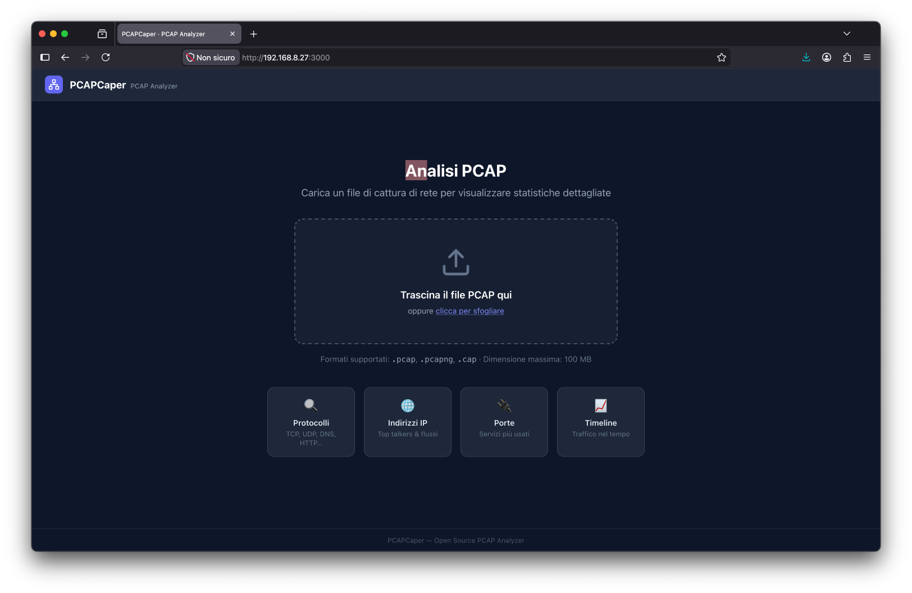
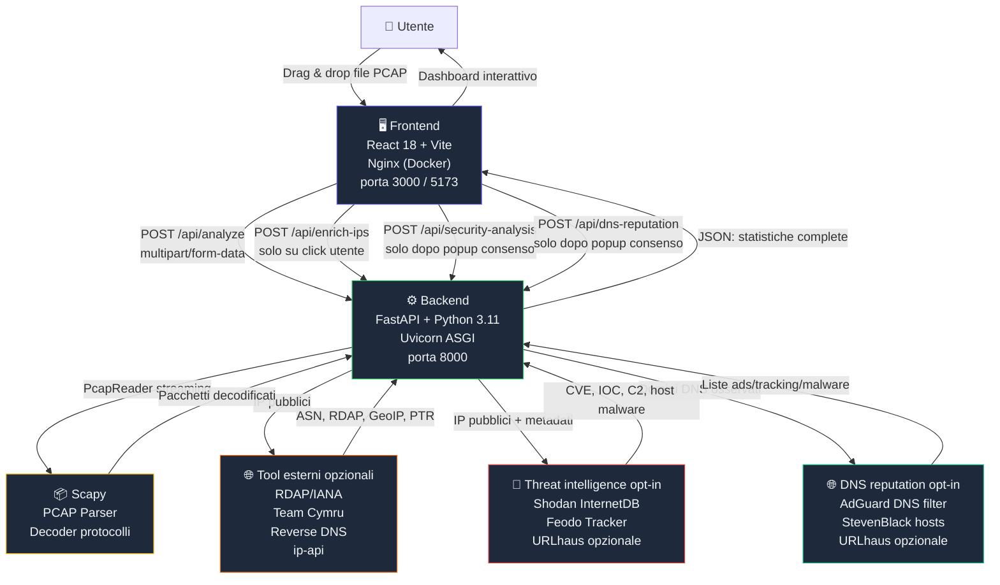
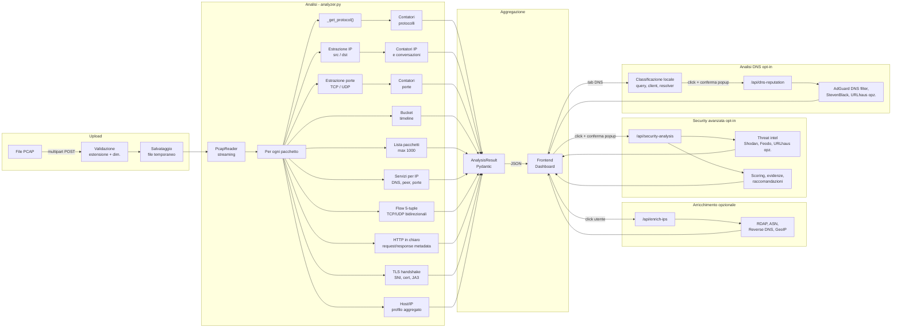

<!-- home -->


<!-- home -->


<!--

-->

# PCAPCaper 🔍

**PCAPCaper** è un analizzatore open source di file PCAP/PCAPNG con interfaccia web moderna.
Carica un file di cattura di rete e ottieni in secondi statistiche complete su protocolli, indirizzi IP, porte, conversazioni, DNS, timeline del traffico, filtri pacchetto, arricchimento IP esterno, mappa geografica, correlazione avanzata dei pacchetti e analisi security con threat intelligence.

> Ispirato a [apackets.com](https://apackets.com/), ma completamente open source e auto-ospitabile.

---

- [PCAPCaper 🔍](#pcapcaper-)
  - [✨ Funzionalità](#-funzionalità)
  - [Screenshot](#screenshot)
    - [Servizio di analisi degli indirizzi IP](#servizio-di-analisi-degli-indirizzi-ip)
    - [Mappa degli indirizzi IP](#mappa-degli-indirizzi-ip)
    - [Advanced packet tracing](#advanced-packet-tracing)
    - [Conferma prima di inviare traffico verso servizi esterni](#conferma-prima-di-inviare-traffico-verso-servizi-esterni)
    - [Nuovo tab sui report di sicurezza](#nuovo-tab-sui-report-di-sicurezza)
    - [DNS analysis](#dns-analysis)
    - [HTTP anaysis](#http-anaysis)
    - [TLS analysis](#tls-analysis)
    - [Classificazione per host](#classificazione-per-host)
    - [Analisi dei flussi di rete per singolo stato](#analisi-dei-flussi-di-rete-per-singolo-stato)
  - [🏗️ Architettura](#️-architettura)
  - [🧩 Stack tecnologico](#-stack-tecnologico)
    - [Backend](#backend)
    - [Frontend](#frontend)
    - [Infrastruttura](#infrastruttura)
  - [📊 Flusso di analisi](#-flusso-di-analisi)
  - [🚀 Avvio locale (senza Docker)](#-avvio-locale-senza-docker)
    - [Prerequisiti](#prerequisiti)
    - [1. Clona il repository](#1-clona-il-repository)
    - [2. Avvia il Backend](#2-avvia-il-backend)
    - [3. Avvia il Frontend](#3-avvia-il-frontend)
  - [🐳 Avvio con Docker](#-avvio-con-docker)
    - [Prerequisiti](#prerequisiti-1)
    - [Avvio completo](#avvio-completo)
    - [Comandi utili](#comandi-utili)
    - [Porte esposte](#porte-esposte)
  - [🔎 Filtri pacchetti stile Wireshark](#-filtri-pacchetti-stile-wireshark)
    - [Operatori logici](#operatori-logici)
    - [Operatori di confronto](#operatori-di-confronto)
    - [Campi supportati](#campi-supportati)
    - [Filtri protocollo rapidi](#filtri-protocollo-rapidi)
    - [Esempi utili](#esempi-utili)
  - [🛰️ Arricchimento IP esterno](#️-arricchimento-ip-esterno)
  - [🌳 Flow 5-tuple e Tracce avanzate](#-flow-5-tuple-e-tracce-avanzate)
  - [🛡️ Security](#️-security)
  - [🚨 Security avanzata](#-security-avanzata)
    - [Fonti e dati usati](#fonti-e-dati-usati)
    - [Output della tab](#output-della-tab)
    - [Privacy e controllo](#privacy-e-controllo)
  - [🌐 Analisi DNS](#-analisi-dns)
    - [Analisi locale](#analisi-locale)
    - [Controllo liste esterne](#controllo-liste-esterne)
    - [Privacy DNS](#privacy-dns)
  - [🌍 HTTP analysis](#-http-analysis)
    - [Limiti HTTP](#limiti-http)
  - [🔐 TLS analysis](#-tls-analysis)
    - [Anomalie TLS](#anomalie-tls)
    - [Limiti TLS](#limiti-tls)
  - [🖥️ Hosts](#️-hosts)
  - [🕸️ Grafo di rete](#️-grafo-di-rete)
  - [📡 API Reference](#-api-reference)
    - [`GET /api/health`](#get-apihealth)
    - [`POST /api/analyze`](#post-apianalyze)
    - [`POST /api/enrich-ips`](#post-apienrich-ips)
    - [`POST /api/security-analysis`](#post-apisecurity-analysis)
    - [`POST /api/dns-reputation`](#post-apidns-reputation)
  - [📁 Struttura del progetto](#-struttura-del-progetto)
  - [🔄 Diagramma dei componenti frontend](#-diagramma-dei-componenti-frontend)
  - [🤝 Contribuire](#-contribuire)
  - [📄 Licenza](#-licenza)


---

## ✨ Funzionalità

| Sezione | Dettagli |
|---|---|
| **Riepilogo** | Pacchetti totali, byte, durata, pacchetti/sec, dimensione media |
| **Protocolli** | Distribuzione con grafico donut + tabella percentuali (top 20) |
| **Top IP** | Indirizzi sorgente/destinazione più attivi, popup dettagli servizi, DNS, peer e dati esterni |
| **Top Porte** | Porte TCP/UDP più usate con nome servizio (top 15 src + dst) |
| **Conversazioni** | Flussi bidirezionali IP↔IP ordinabili per pacchetti o byte (top 20) |
| **Filtri pacchetti** | Filtri stile Wireshark con input testuale e builder GUI |
| **Hosts** | Vista dettaglio IP collapsable con ruolo, flow, DNS, HTTP/SNI, ASN/geo e timeline attività |
| **Grafo di rete** | Network graph host-to-host basato sui flow, con filtri per protocollo, scope e finding |
| **DNS** | Dashboard stile AdGuard per richieste DNS, domini frequenti, tracking, ads, malware e reputazione opt-in |
| **HTTP analysis** | Estrazione metadati HTTP in chiaro: richieste, risposte correlate, host, user-agent e status code |
| **TLS analysis** | Metadati handshake SSL/TLS: SNI, versione, cipher, ALPN, certificato, fingerprint, JA3/JA3S e anomalie |
| **Arricchimento IP esterno** | RDAP/IANA, Team Cymru ASN, reverse DNS e GeoIP su richiesta esplicita |
| **Security** | Segnalazioni euristiche su proxy/VPN, hosting, porte sensibili, servizi non cifrati e volumi anomali |
| **Security avanzata** | Tab dedicata con consenso esplicito, threat intelligence, CVE, IOC, scoring, evidenze e raccomandazioni |
| **Mappa traffico IP** | Mappa mondiale con stati colorati in base al traffico verso IP geolocalizzati; click sul paese per vedere i flow collegati |
| **Tracce avanzate** | Alberatura dei flow con pacchetti, risposte e ACK correlati; usa i flow 5-tuple calcolati dal backend |
| **Timeline** | Area chart del traffico nel tempo con bucket adattivi |
| **Lista Pacchetti** | Primi 1000 pacchetti con ricerca full-text e paginazione |
| **Esporta JSON** | Scarica il risultato dell'analisi in formato JSON |

Formati supportati: `.pcap`, `.pcapng`, `.cap` · Limite dimensione: **100 MB**

---

## Screenshot

**dettaglio su indirizzi IP**


### Servizio di analisi degli indirizzi IP


### Mappa degli indirizzi IP


La sezione **Mappa traffico IP** usa l'arricchimento geografico degli IP pubblici per colorare i paesi in base al traffico osservato. Cliccando su un paese colorato si apre un popup con:
- IP geolocalizzati in quel paese;
- flow 5-tuple che coinvolgono quegli IP;
- endpoint sorgente/destinazione;
- protocollo, stato, byte e pacchetti del flow;
- quota di traffico attribuita al paese.

### Advanced packet tracing


### Conferma prima di inviare traffico verso servizi esterni


### Nuovo tab sui report di sicurezza


### DNS analysis


### HTTP anaysis


### TLS analysis


### Classificazione per host


### Analisi dei flussi di rete per singolo stato


<!--

-->

---

## 🏗️ Architettura



---

## 🧩 Stack tecnologico

### Backend
| Tecnologia | Versione | Ruolo |
|---|---|---|
| Python | 3.11 | Runtime |
| FastAPI | 0.115 | Framework REST API |
| Scapy | 2.6 | Lettura e decodifica PCAP |
| Uvicorn | 0.34 | Server ASGI |
| Pydantic | v2 | Validazione e serializzazione dati |

### Frontend
| Tecnologia | Versione | Ruolo |
|---|---|---|
| React | 18 | UI framework |
| TypeScript | 5.5 | Type safety |
| Vite | 5 | Build tool e dev server |
| Tailwind CSS | 3.4 | Utility-first CSS |
| Recharts | 2.12 | Grafici (Area, Bar, Pie) |
| Lucide React | — | Icone SVG |

### Infrastruttura
| Tecnologia | Ruolo |
|---|---|
| Docker + docker-compose | Containerizzazione |
| Nginx 1.27 | Serve il frontend + proxy verso il backend |

---

## 📊 Flusso di analisi



---

## 🚀 Avvio locale (senza Docker)

### Prerequisiti
- Python **3.11** o superiore
- Node.js **20** o superiore
- `pip` e `npm`
- Su macOS: `brew install libpcap` (necessario per Scapy)
- Su Linux (Debian/Ubuntu): `sudo apt-get install libpcap-dev`

### 1. Clona il repository

```bash
git clone https://github.com/tuo-utente/pcapcaper.git
cd pcapcaper
```

### 2. Avvia il Backend

```bash
cd backend

# Crea e attiva un virtual environment (raccomandato)
python -m venv .venv
source .venv/bin/activate        # Linux/macOS
# oppure: .venv\Scripts\activate  # Windows

# Installa le dipendenze
pip install -r requirements.txt

# Avvia il server FastAPI con hot-reload
uvicorn main:app --reload --host 0.0.0.0 --port 8000
```

Il backend sarà disponibile su `http://localhost:8000`  
Documentazione API interattiva: `http://localhost:8000/docs`

### 3. Avvia il Frontend

Apri un **nuovo terminale**:

```bash
cd frontend

# Installa le dipendenze npm
npm install

# Avvia il dev server Vite con proxy verso il backend
npm run dev
```

Il frontend sarà disponibile su `http://localhost:5173`

> Vite proxy-izza automaticamente le richieste `/api/*` verso `localhost:8000`,
> quindi non è necessario configurare nulla manualmente.

---

## 🐳 Avvio con Docker

### Prerequisiti
- Docker **24+**
- Docker Compose **v2** (incluso in Docker Desktop)

### Avvio completo

```bash
# Clona il repository (se non l'hai già fatto)
git clone https://github.com/tuo-utente/pcapcaper.git
cd pcapcaper

# Build delle immagini e avvio dei container
docker-compose up --build
```

Apri il browser su **`http://localhost:3000`** 🎉

### Comandi utili

```bash
# Avvio in background (detached)
docker-compose up --build -d

# Visualizza i log in tempo reale
docker-compose logs -f

# Ferma i container (mantieni le immagini)
docker-compose stop

# Ferma e rimuovi container e reti
docker-compose down

# Ricostruisci solo il backend dopo modifiche
docker-compose up --build backend
```

### Porte esposte

| Servizio  | Porta host | Porta container | Note |
|-----------|-----------|-----------------|------|
| Frontend  | 3000      | 80              | Interfaccia web |
| Backend   | 8000      | 8000            | API REST (opzionale, per debug) |

---

## 🔎 Filtri pacchetti stile Wireshark

La dashboard include una scheda **Filtri pacchetti** applicata alla lista pacchetti e alla vista **Tracce**. I riepiloghi statistici principali restano calcolati sull'intero PCAP, mentre le viste pacchetto mostrano solo gli elementi che corrispondono al filtro.

Puoi usare sia il campo testuale sia i controlli GUI per comporre il filtro.

### Operatori logici

| Operatore | Descrizione | Esempio |
|-----------|-------------|---------|
| `and` / `&&` | Entrambe le condizioni devono essere vere | `dns and ip.dst == 8.8.8.8` |
| `or` / `||` | Almeno una condizione deve essere vera | `http or https` |
| `not` / `!` | Nega una condizione | `not arp` |
| `( ... )` | Raggruppa condizioni | `(dns or http) and frame.len > 100` |

### Operatori di confronto

| Operatore | Descrizione | Esempio |
|-----------|-------------|---------|
| `==` | Valore uguale | `tcp.port == 443` |
| `!=` | Valore diverso | `ip.src != 192.168.1.10` |
| `contains` | Campo testuale che contiene una stringa | `info contains "Query"` |
| `>` | Maggiore di | `frame.len > 1000` |
| `>=` | Maggiore o uguale | `frame.number >= 500` |
| `<` | Minore di | `frame.len < 128` |
| `<=` | Minore o uguale | `frame.number <= 100` |

### Campi supportati

| Campo | Alias | Descrizione |
|-------|-------|-------------|
| `ip.addr` | `ip` | IP sorgente o destinazione |
| `ip.src` | `src`, `src.ip` | IP sorgente |
| `ip.dst` | `dst`, `dst.ip` | IP destinazione |
| `tcp.port` | `port` | Porta sorgente o destinazione nei pacchetti TCP |
| `udp.port` | `port` | Porta sorgente o destinazione nei pacchetti UDP |
| `tcp.srcport` | `udp.srcport`, `src.port` | Porta sorgente |
| `tcp.dstport` | `udp.dstport`, `dst.port` | Porta destinazione |
| `frame.len` | `len`, `length` | Lunghezza del pacchetto in byte |
| `frame.number` | `number`, `no` | Numero progressivo del pacchetto |
| `frame.time` | `time` | Timestamp mostrato nella tabella |
| `protocol` | `proto` | Protocollo rilevato |
| `info` | - | Campo informativo del pacchetto |

### Filtri protocollo rapidi

Puoi scrivere direttamente il nome del protocollo senza campo e operatore:

| Filtro | Significato |
|--------|-------------|
| `ip` | Pacchetti IP/IPv4/IPv6 |
| `tcp` | Pacchetti TCP |
| `udp` | Pacchetti UDP |
| `dns` | DNS/mDNS |
| `http` | HTTP/HTTP-Alt |
| `https` | HTTPS/HTTPS-Alt |
| `tls` | Traffico classificato come HTTPS/TLS |
| `arp` | ARP |
| `icmp` | ICMP |
| `ssh` | SSH |

### Esempi utili

```text
ip.addr == 8.8.8.8
ip.src == 192.168.1.10 and dns
tcp.port == 443
udp.dstport == 53
frame.len > 1000
info contains "Query"
(http or https) and not ip.dst == 192.168.1.1
```

---

## 🛰️ Arricchimento IP esterno

Il pulsante **Analizza con tool esterni** mostra prima un popup di consenso, poi invia al backend gli IP osservati nel PCAP e recupera informazioni aggiuntive usando più fonti:

| Fonte | Dati recuperati |
|-------|-----------------|
| RDAP/IANA | Registry, range IP, handle, nome risorsa, entità e note RDAP |
| Team Cymru | ASN, prefisso BGP, registry, country code e AS name |
| Reverse DNS | Nome PTR associato all'indirizzo IP |
| ip-api | Paese, regione, città, ISP, organizzazione, timezone, proxy/VPN, mobile e hosting |

Gli indirizzi privati, locali, multicast, riservati o comunque non globali vengono scartati e **non vengono inviati a servizi esterni**. L'arricchimento è opt-in: avviene solo quando l'utente conferma il popup dedicato.

I risultati vengono usati per:
- arricchire il popup **Top IP**;
- colorare la **Mappa traffico IP** e mostrare i flow collegati quando si clicca su un paese;
- alimentare il pannello **Security**;
- fornire contesto alla tab **Security avanzata**;
- includere le informazioni esterne nell'export JSON.

---

## 🌳 Flow 5-tuple e Tracce avanzate

Il backend ricostruisce veri flow 5-tuple TCP/UDP durante la lettura streaming del PCAP. Ogni flow è identificato dal primo verso osservato:

```text
src_ip, src_port, dst_ip, dst_port, protocollo L4
```

I pacchetti nel verso inverso vengono associati allo stesso flow tramite una chiave bidirezionale, ma il JSON conserva il 5-tuple originale e un `flow_id` stabile.

Per ogni elemento in `flows` vengono calcolati:
- `flow_id`;
- IP e porta sorgente;
- IP e porta destinazione;
- protocollo L4;
- primo e ultimo timestamp;
- durata;
- pacchetti e byte totali;
- pacchetti e byte client -> server;
- pacchetti e byte server -> client;
- flag TCP aggregati;
- stato approssimativo (`opening`, `established`, `closing`, `closed`, `reset`, `request_response`, `one_way`, ecc.);
- numeri dei pacchetti appartenenti al flow.

La tab **Tracce avanzate** usa questi dati per mostrare sulle radici dell'alberatura l'ID del flow, lo stato calcolato dal backend e i contatori direzionali C->S/S->C. La correlazione visuale pacchetto-risposta-ACK resta disponibile come albero navigabile.

---

## 🛡️ Security

Il container **Security** segnala connessioni potenzialmente rischiose usando le informazioni raccolte localmente e tramite arricchimento esterno. Le segnalazioni sono euristiche e non sostituiscono feed di threat intelligence o blacklist dedicate.

Le regole attuali considerano:
- IP segnalati come proxy/VPN;
- IP associati a hosting/datacenter;
- traffico verso servizi non cifrati come HTTP, FTP, Telnet, SMTP, POP3 e IMAP;
- servizi di amministrazione remota come SSH, RDP, VNC, SMB e Telnet;
- servizi database come MySQL, PostgreSQL, Redis, MongoDB, MSSQL e Oracle;
- porte sensibili;
- volume di traffico elevato rispetto alle altre destinazioni;
- destinazioni geolocalizzate fuori dal contesto locale.

Ogni finding mostra IP, severità, score, ASN/paese se disponibili, volume, pacchetti e motivazioni concrete.

---

## 🚨 Security avanzata

La tab **Security avanzata** esegue un'analisi più profonda e più simile a un triage professionale. Per ridurre spreco di CPU e richieste esterne, il workflow è esplicito:

1. carica e analizza il PCAP;
2. premi **Analizza con tool esterni** per arricchire gli IP;
3. apri **Security avanzata**;
4. premi **Analisi di sicurezza**;
5. conferma il popup che informa sull'uso di servizi esterni.

Solo dopo la conferma vengono chiamati i servizi di threat intelligence.

### Fonti e dati usati

| Fonte | Requisiti | Dati usati |
|-------|-----------|-----------|
| Shodan InternetDB | Nessuna API key | Porte esposte, CPE, tag, hostname e CVE associate all'IP |
| Feodo Tracker | Nessuna API key | Indicatori C2 botnet dal feed pubblico JSON |
| URLhaus | Variabile backend `URLHAUS_AUTH_KEY` | Host associati a URL di distribuzione malware |
| Motore locale PCAPCaper | Nessuno | Peer, porte, protocolli, volumi, fan-out, campioni pacchetto |
| Arricchimento IP precedente | Click su "Analizza con tool esterni" | ASN, paese, proxy/VPN, hosting/datacenter, reverse DNS |

### Output della tab

La tab mostra:
- conteggi per severità: critica, alta, media, bassa;
- finding ordinati per rischio;
- score 0-100 e confidenza;
- evidenze concrete tratte da pacchetti e fonti esterne;
- raccomandazioni operative per triage, contenimento o verifica;
- riferimenti MITRE ATT&CK quando pertinenti;
- stato delle fonti usate e errori non bloccanti;
- classifica degli IP più rischiosi.

### Privacy e controllo

La chiamata a `/api/security-analysis` è opt-in. Il popup informa l'utente prima di inviare dati a servizi terzi. Il backend analizza solo IP pubblici per le interrogazioni esterne; IP privati, locali o riservati non vengono usati per le query di threat intelligence.

Per abilitare URLhaus:

```bash
export URLHAUS_AUTH_KEY="la-tua-auth-key"
uvicorn main:app --reload --host 0.0.0.0 --port 8000
```

Senza `URLHAUS_AUTH_KEY`, la fonte URLhaus viene mostrata come `skipped` e l'analisi prosegue con le altre fonti.

---

## 🌐 Analisi DNS

La tab **DNS** è dedicata esclusivamente alle richieste DNS osservate nel PCAP. La vista è pensata in stile AdGuard: riepilogo immediato, domini più richiesti, client più attivi, resolver usati e indicatori di tracking, advertising o rischio.

### Analisi locale

Senza inviare dati all'esterno, il backend produce una sezione `dns` nel JSON dell'analisi. La tab:
- estrae query DNS, tipo record e transaction ID;
- correla risposte alla query quando possibile;
- mostra codice risposta (`NOERROR`, `NXDOMAIN`, `SERVFAIL`, `REFUSED`, ecc.);
- mostra answer e TTL quando disponibili;
- calcola client richiedente e resolver interrogato;
- aggrega domini più richiesti, client più attivi e resolver più usati;
- calcola il rapporto NXDOMAIN;
- segnala query TXT sospette;
- evidenzia possibili indicatori di DNS tunneling: label molto lunghe, molti sottodomini unici, entropia approssimata elevata e volume anomalo verso lo stesso dominio;
- correla dominio -> IP di risposta -> flow successivi quando l'IP restituito compare nei flow 5-tuple.

La vista include filtri per dominio, client, tipo record e rcode.

### Controllo liste esterne

Il pulsante **Controlla liste esterne** mostra prima un popup di consenso. Solo dopo la conferma, il backend confronta i domini con:

| Fonte | Requisiti | Dati usati |
|-------|-----------|-----------|
| AdGuard DNS filter | Nessuna API key | Regole DNS-level per ads, tracking, cryptomining e domini malevoli |
| StevenBlack hosts | Nessuna API key | Hosts list aggregata con domini ads/tracking/malware |
| URLhaus | Variabile backend `URLHAUS_AUTH_KEY` | Host associati a URL di distribuzione malware |

La risposta mostra fonti usate, stato dei download, errori non bloccanti, categorie e regole che hanno prodotto il match.

### Privacy DNS

L'analisi DNS locale è privacy-by-default: usa solo il PCAP caricato e non invia domini a servizi esterni. La reputazione DNS esterna è opt-in. Nessun dominio viene inviato a servizi esterni durante il caricamento PCAP o l'analisi standard. L'invio avviene solo dalla tab **DNS**, dopo conferma esplicita dell'utente.

---

## 🌍 HTTP analysis

La tab **HTTP analysis** mostra metadati HTTP estratti solo da traffico in chiaro. Non decifra HTTPS/TLS e non invia dati a servizi esterni.

Per le richieste HTTP vengono estratti, quando disponibili:
- timestamp;
- client IP/porta;
- server IP/porta;
- metodo;
- host;
- URI/path;
- user-agent;
- referer;
- content-type;
- dimensione approssimativa payload.

Per le risposte HTTP vengono estratti:
- status code;
- reason phrase;
- header `Server`;
- content-type;
- content-length;
- file name dedotto da `Content-Disposition` o dalla URI della richiesta.

La tab include:
- tabella richieste con risposta correlata quando possibile;
- host più contattati;
- user-agent più frequenti;
- filtri per host, metodo, status e user-agent.

### Limiti HTTP

Il parser è prudente:
- analizza solo payload TCP che iniziano come HTTP testuale;
- non ricostruisce stream TCP completi;
- header o body frammentati possono essere marcati come parziali;
- la dimensione payload è stimata da `Content-Length` o dai byte presenti nel segmento osservato;
- il traffico cifrato HTTPS/TLS non viene interpretato.

---

## 🔐 TLS analysis

La tab **TLS analysis** analizza SSL/TLS usando solo metadati osservabili nei record di handshake presenti nel PCAP. Non decifra traffico, non richiede chiavi private e non mostra contenuti applicativi cifrati.

Quando disponibili vengono estratti:
- SNI dal `ClientHello`;
- versione TLS offerta o negoziata;
- cipher suite negoziata dal `ServerHello`;
- ALPN annunciato o negoziato;
- subject e issuer del certificato leaf;
- validità del certificato;
- fingerprint SHA256 del certificato DER;
- fingerprint JA3 e JA3S quando i messaggi necessari sono completi;
- stato parziale quando record o handshake risultano frammentati.

La tab include:
- tabella connessioni TLS con client, server, SNI, versione, cipher, certificato e fingerprint;
- filtri per SNI, server IP, versione e presenza anomalie;
- riepilogo SNI più frequenti, versioni TLS e issuer certificato;
- pannello limiti parser per distinguere chiaramente cosa è osservabile e cosa non lo è.

### Anomalie TLS

Le anomalie sono euristiche e basate sui soli metadati disponibili:
- certificato scaduto rispetto al timestamp della cattura;
- certificato non ancora valido;
- certificato self-signed;
- SNI mancante;
- TLS legacy (`SSL 3.0`, `TLS 1.0`, `TLS 1.1`);
- mismatch approssimato tra DNS osservato nel PCAP e SNI, quando entrambi sono disponibili.

### Limiti TLS

Il parser TLS è volutamente conservativo:
- non decifra payload TLS e non recupera URL, header HTTP o contenuti cifrati;
- non ricostruisce stream TCP completi;
- record TLS frammentati su più segmenti possono essere marcati come parziali;
- subject e issuer sono disponibili solo se il certificato è presente nel PCAP e decodificabile dalla libreria standard Python;
- il mismatch DNS/SNI usa solo risposte DNS viste nella cattura, quindi può produrre falsi positivi se il DNS è assente, cacheato o risolto fuori cattura.

---

## 🖥️ Hosts

La tab **Hosts** mostra una vista dettaglio per ogni IP osservato nel PCAP. Le sezioni sono collapsable, chiuse di default, e possono essere aperte quando serve approfondire un host specifico. Gli IP nella lista pacchetti sono cliccabili: il click apre direttamente la tab **Hosts** filtrata su quell'indirizzo.

Per ogni host vengono mostrati:
- ruolo stimato: `client`, `server`, `misto` o `ignoto`;
- classificazione privato/pubblico;
- hostname dedotti da DNS osservato nel PCAP e reverse DNS da tool esterni quando disponibile;
- ASN, organizzazione e geolocalizzazione se l'arricchimento IP è stato abilitato dall'utente;
- protocolli usati;
- porte remote contattate;
- porte esposte/osservate come lato server;
- byte e pacchetti inviati/ricevuti;
- flow collegati;
- query DNS generate;
- SNI TLS e host HTTP osservati;
- finding associati, ad esempio HTTP in chiaro o anomalie TLS;
- timeline attività con byte inviati/ricevuti per bucket temporale.

La sezione `hosts` viene calcolata dal backend durante l'analisi standard e non invia dati a servizi esterni. I dati ASN/geo vengono solo visualizzati quando sono già presenti in `external_ip_info`, cioè dopo il consenso dell'utente tramite **Analizza con tool esterni**.

---

## 🕸️ Grafo di rete

La tab **Grafo** mostra una rappresentazione host-to-host costruita dai flow 5-tuple calcolati dal backend.

Caratteristiche principali:
- ogni nodo rappresenta un IP/host;
- ogni arco aggrega uno o più flow tra due host;
- lo spessore dell'arco può essere basato su byte o pacchetti;
- il colore del nodo evidenzia host interni/esterni e presenza di finding;
- il grafo è limitato ai flow più pesanti quando la cattura è molto grande, per mantenere la UI reattiva.

Filtri disponibili:
- protocollo del flow;
- comunicazioni interne, esterne o interno ↔ esterno;
- severità finding dedotta dalle evidenze disponibili;
- metrica di peso: byte o pacchetti.

Interazioni:
- click su un nodo: riepilogo host, traffico, protocolli, flow collegati e finding;
- click su un arco: flow sottostanti, endpoint, traffico, pacchetti e stato del flow.

La vista è implementata in SVG senza introdurre nuove dipendenze frontend.

---

## 📡 API Reference

### `GET /api/health`

Verifica che il backend sia attivo.

**Risposta:**
```json
{ "status": "ok", "service": "pcap-analyzer" }
```

---

### `POST /api/analyze`

Analizza un file PCAP e restituisce le statistiche.

**Request:** `Content-Type: multipart/form-data`

| Campo | Tipo | Descrizione |
|-------|------|-------------|
| `file` | File | File `.pcap`, `.pcapng` o `.cap` (max 100 MB) |

**Risposta (200 OK):**
```json
{
  "filename": "capture.pcap",
  "summary": {
    "total_packets": 12543,
    "total_bytes": 9876543,
    "capture_start": "2024-03-15T10:23:01+00:00",
    "capture_end": "2024-03-15T10:28:47+00:00",
    "duration_seconds": 346.2,
    "avg_packet_size": 787.5,
    "packets_per_second": 36.2
  },
  "protocols": [
    { "protocol": "HTTPS", "count": 4521, "bytes": 6234512, "percentage": 36.04 }
  ],
  "top_src_ips": [
    {
      "ip": "192.168.1.10",
      "count": 3201,
      "bytes": 4512000,
      "protocols": ["TCP", "HTTPS"],
      "hostnames": [],
      "peers": ["93.184.216.34"],
      "services": [
        {
          "service": "HTTPS",
          "port": 443,
          "protocol": "TCP",
          "direction": "client",
          "count": 1200,
          "peers": ["93.184.216.34"]
        }
      ]
    }
  ],
  "top_dst_ips": [ ... ],
  "top_src_ports": [ { "port": 443, "service": "HTTPS", "count": 4521, "protocol": "TCP" } ],
  "top_dst_ports": [ ... ],
  "conversations": [
    { "src_ip": "10.0.0.1", "dst_ip": "8.8.8.8", "packets": 120, "bytes": 9800, "protocols": ["DNS"] }
  ],
  "flows": [
    {
      "flow_id": "a1b2c3d4e5f60789",
      "src_ip": "192.168.1.10",
      "src_port": 52341,
      "dst_ip": "8.8.8.8",
      "dst_port": 53,
      "protocol": "UDP",
      "first_seen": "2024-03-15T10:23:01.123000+00:00",
      "last_seen": "2024-03-15T10:23:01.190000+00:00",
      "duration_seconds": 0.067,
      "packets_total": 2,
      "bytes_total": 148,
      "packets_client_to_server": 1,
      "packets_server_to_client": 1,
      "bytes_client_to_server": 74,
      "bytes_server_to_client": 74,
      "tcp_flags": [],
      "state": "request_response",
      "packet_numbers": [1, 2]
    }
  ],
  "dns": {
    "stats": {
      "total_queries": 1,
      "total_responses": 1,
      "unique_domains": 1,
      "nxdomain_count": 0,
      "nxdomain_ratio": 0.0,
      "txt_query_count": 0,
      "suspicious_txt_count": 0
    },
    "queries": [
      {
        "packet_number": 1,
        "timestamp": "2024-03-15T10:23:01.123000+00:00",
        "client": "192.168.1.10",
        "resolver": "8.8.8.8",
        "transaction_id": 4242,
        "query": "example.com",
        "record_type": "A",
        "response_code": 0,
        "response_code_name": "NOERROR",
        "response_packet_number": 2,
        "answers": [
          { "name": "example.com", "record_type": "A", "value": "93.184.216.34", "ttl": 300 }
        ],
        "ttls": [300],
        "answer_ips": ["93.184.216.34"],
        "txt_answers": [],
        "suspicious_txt": false,
        "indicators": []
      }
    ],
    "top_domains": [{ "value": "example.com", "count": 1 }],
    "top_clients": [{ "value": "192.168.1.10", "count": 1 }],
    "top_resolvers": [{ "value": "8.8.8.8", "count": 1 }],
    "tunneling_indicators": [],
    "flow_correlations": [
      { "domain": "example.com", "answer_ip": "93.184.216.34", "flow_ids": ["..."], "dns_packet_numbers": [1] }
    ]
  },
  "http": {
    "stats": {
      "total_requests": 1,
      "total_responses": 1,
      "correlated_responses": 1,
      "partial_requests": 0,
      "partial_responses": 0,
      "unique_hosts": 1
    },
    "requests": [
      {
        "packet_number": 10,
        "timestamp": "2024-03-15T10:23:02.000000+00:00",
        "client_ip": "192.168.1.10",
        "client_port": 52344,
        "server_ip": "93.184.216.34",
        "server_port": 80,
        "method": "GET",
        "host": "example.com",
        "uri": "/index.html",
        "user_agent": "curl/8.0",
        "referer": null,
        "content_type": null,
        "payload_size": 0,
        "partial": false,
        "response_packet_number": 11,
        "response_status_code": 200,
        "response_reason": "OK",
        "response_server": "nginx",
        "response_content_type": "text/html",
        "response_content_length": 1256,
        "response_file_name": "index.html",
        "response_partial": false
      }
    ],
    "top_hosts": [{ "value": "example.com", "count": 1 }],
    "top_user_agents": [{ "value": "curl/8.0", "count": 1 }],
    "limitations": ["Analizza solo traffico HTTP in chiaro su TCP.", "Non decifra HTTPS/TLS."]
  },
  "tls": {
    "stats": {
      "total_connections": 1,
      "with_sni": 1,
      "with_certificate": 1,
      "anomalous_connections": 0,
      "expired_certificates": 0,
      "legacy_tls": 0
    },
    "connections": [
      {
        "packet_number": 20,
        "timestamp": "2024-03-15T10:23:03.000000+00:00",
        "client_ip": "192.168.1.10",
        "client_port": 52345,
        "server_ip": "93.184.216.34",
        "server_port": 443,
        "sni": "example.com",
        "tls_version": "TLS 1.3",
        "cipher_suite": "TLS_AES_128_GCM_SHA256",
        "alpn": ["h2", "http/1.1"],
        "cert_subject": "commonName=example.com",
        "cert_issuer": "commonName=Example CA",
        "cert_not_before": "Mar 01 00:00:00 2024 GMT",
        "cert_not_after": "Mar 01 23:59:59 2025 GMT",
        "cert_sha256": "012345...",
        "ja3": "d4f...",
        "ja3_string": "771,...",
        "ja3s": "15a...",
        "ja3s_string": "771,4865,...",
        "anomalies": [],
        "partial": false
      }
    ],
    "top_sni": [{ "value": "example.com", "count": 1 }],
    "top_issuers": [{ "value": "commonName=Example CA", "count": 1 }],
    "top_versions": [{ "value": "TLS 1.3", "count": 1 }],
    "limitations": ["Non decifra il traffico TLS e non recupera contenuti applicativi."]
  },
  "hosts": {
    "total_hosts": 2,
    "hosts": [
      {
        "ip": "192.168.1.10",
        "role": "client",
        "is_private": true,
        "hostnames": [],
        "protocols": ["DNS", "TCP", "TLS"],
        "contacted_ports": [53, 80, 443],
        "exposed_ports": [],
        "bytes_sent": 2450,
        "bytes_received": 9820,
        "packets_sent": 22,
        "packets_received": 24,
        "flow_ids": ["a1b2c3d4e5f60789"],
        "dns_queries": ["example.com"],
        "sni_hosts": ["example.com"],
        "http_hosts": ["example.com"],
        "findings": ["HTTP in chiaro verso example.com"],
        "timeline": [
          {
            "timestamp": "10:23:01",
            "packets_sent": 2,
            "packets_received": 1,
            "bytes_sent": 148,
            "bytes_received": 74
          }
        ]
      }
    ]
  },
  "timeline": [
    { "timestamp": "10:23:01", "packets": 45, "bytes": 38000 }
  ],
  "packets": [
    {
      "number": 1, "timestamp": "10:23:01.123", "src_ip": "192.168.1.10",
      "dst_ip": "8.8.8.8", "protocol": "DNS", "length": 74,
      "src_port": 52341, "dst_port": 53, "info": "DNS Query: google.com"
    }
  ],
  "external_ip_info": {}
}
```

**Errori:**

| Codice | Causa |
|--------|-------|
| 400 | Estensione file non supportata o file vuoto |
| 413 | File troppo grande (> 100 MB) |
| 422 | File PCAP corrotto o senza pacchetti validi |
| 500 | Errore interno del server |

---

### `POST /api/enrich-ips`

Arricchisce una lista di IP usando tool esterni. L'endpoint è usato dal pulsante **Analizza con tool esterni**.

**Request:** `Content-Type: application/json`

```json
{
  "ips": ["8.8.8.8", "1.1.1.1", "192.168.1.10"]
}
```

**Risposta (200 OK):**

```json
{
  "results": {
    "8.8.8.8": {
      "ip": "8.8.8.8",
      "status": "enriched",
      "sources": ["Reverse DNS", "Team Cymru", "RDAP/IANA", "ip-api"],
      "reverse_dns": "dns.google",
      "asn": "15169",
      "as_name": "GOOGLE",
      "bgp_prefix": "8.8.8.0/24",
      "registry": "arin",
      "country": "United States",
      "country_code": "US",
      "isp": "Google LLC",
      "org": "Google Public DNS",
      "proxy": false,
      "hosting": true,
      "errors": []
    },
    "192.168.1.10": {
      "ip": "192.168.1.10",
      "status": "skipped",
      "reason": "Indirizzo privato, locale, riservato o non valido: non inviato a servizi esterni."
    }
  }
}
```

**Note privacy:** il backend scarta gli IP non globali prima di qualunque chiamata esterna.

---

### `POST /api/security-analysis`

Esegue l'analisi di sicurezza avanzata del traffico. L'endpoint viene chiamato dalla tab **Security avanzata** solo dopo conferma esplicita dell'utente.

**Request:** `Content-Type: application/json`

```json
{
  "packets": [
    {
      "number": 1,
      "timestamp": "10:23:01.123",
      "src_ip": "192.168.1.10",
      "dst_ip": "8.8.8.8",
      "protocol": "DNS",
      "length": 74,
      "src_port": 52341,
      "dst_port": 53,
      "info": "DNS Query"
    }
  ],
  "external_ip_info": {
    "8.8.8.8": {
      "ip": "8.8.8.8",
      "status": "enriched",
      "sources": ["Reverse DNS", "Team Cymru", "RDAP/IANA", "ip-api"]
    }
  },
  "max_ips": 80
}
```

**Risposta (200 OK):**

```json
{
  "summary": {
    "total_ips": 12,
    "analyzed_public_ips": 4,
    "critical": 0,
    "high": 1,
    "medium": 2,
    "low": 3,
    "info": 0,
    "total_findings": 6
  },
  "findings": [
    {
      "id": "vulns-93.184.216.34",
      "severity": "high",
      "category": "Exposure",
      "title": "Servizi esposti con CVE note secondo Shodan InternetDB",
      "ip": "93.184.216.34",
      "score": 86,
      "confidence": 78,
      "sources": ["Shodan InternetDB", "Traffico PCAP"],
      "evidence": ["CVE: CVE-..."],
      "recommendation": "Confermare le CVE con scansione autorizzata..."
    }
  ],
  "ip_assessments": [ ... ],
  "sources": [
    { "source": "Shodan InternetDB", "status": "ok", "detail": "4/4 IP con risposta utile o 404 gestito" }
  ],
  "errors": []
}
```

**Fonti esterne:** Shodan InternetDB, Feodo Tracker e URLhaus opzionale con `URLHAUS_AUTH_KEY`.

---

### `POST /api/dns-reputation`

Confronta i domini DNS osservati con liste esterne aperte. L'endpoint viene chiamato dalla tab **DNS** solo dopo conferma esplicita dell'utente.

**Request:** `Content-Type: application/json`

```json
{
  "domains": ["analytics.example.com", "cdn.example.org"],
  "max_domains": 250
}
```

**Risposta (200 OK):**

```json
{
  "results": {
    "analytics.example.com": {
      "domain": "analytics.example.com",
      "status": "listed",
      "categories": ["tracking"],
      "sources": ["AdGuard DNS filter"],
      "matched_rules": ["analytics.example.com: ||analytics.example.com^"],
      "score": 55
    }
  },
  "sources": [
    { "source": "AdGuard DNS filter", "status": "ok", "detail": "regole dominio caricate" },
    { "source": "StevenBlack hosts", "status": "ok", "detail": "domini hosts caricati" },
    { "source": "URLhaus", "status": "skipped", "detail": "Auth-Key non configurata: fonte saltata" }
  ],
  "errors": []
}
```

**Fonti esterne:** AdGuard DNS filter, StevenBlack hosts e URLhaus opzionale con `URLHAUS_AUTH_KEY`.

---

## 📁 Struttura del progetto

```
pcapcaper/
├── backend/
│   ├── main.py          # Entry point FastAPI: health, analyze, enrich-ips
│   ├── analyzer.py      # Motore di analisi PCAP (Scapy + aggregazione statistica)
│   ├── flow_analysis.py # Ricostruzione flow 5-tuple TCP/UDP
│   ├── dns_analysis.py  # Analisi DNS locale: query, risposte, rcode, TTL, tunneling
│   ├── http_analysis.py # Analisi HTTP in chiaro: richieste, risposte e header
│   ├── tls_analysis.py  # Analisi TLS metadata-only: SNI, certificati, JA3/JA3S
│   ├── host_analysis.py # Vista aggregata host/IP con flow, DNS, HTTP, TLS e timeline
│   ├── external_enrichment.py # Arricchimento IP esterno opt-in
│   ├── security_analysis.py # Motore Security avanzato + threat intelligence
│   ├── dns_intelligence.py # Reputazione DNS opt-in su liste aperte
│   ├── models.py        # Modelli Pydantic per request/response
│   ├── requirements.txt # Dipendenze Python
│   └── Dockerfile       # Immagine Docker del backend
│
├── frontend/
│   ├── src/
│   │   ├── main.tsx                    # Entry point React
│   │   ├── App.tsx                     # Componente radice (routing stati)
│   │   ├── index.css                   # Stili globali + Tailwind
│   │   ├── types/
│   │   │   └── analysis.ts             # Tipi TypeScript (mirror dei modelli Python)
│   │   ├── utils/
│   │   │   ├── format.ts               # Formattazione (byte, durata, colori)
│   │   │   └── packetFilters.ts        # Parser filtri stile Wireshark
│   │   └── components/
│   │       ├── FileUpload.tsx          # Area drag & drop per il caricamento
│   │       ├── Dashboard.tsx           # Layout del dashboard (contenitore)
│   │       ├── SummaryCards.tsx        # 6 card metriche principali
│   │       ├── PacketFilters.tsx       # Filtri testuali e GUI stile Wireshark
│   │       ├── ProtocolChart.tsx       # Donut chart + tabella protocolli
│   │       ├── TopIPsChart.tsx         # Bar chart IP + popup servizi e dati esterni
│   │       ├── SecurityPanel.tsx       # Segnalazioni euristiche di rischio
│   │       ├── SecurityAnalysisView.tsx # Tab Security avanzata con consenso e finding
│   │       ├── DNSAnalysisView.tsx     # Dashboard DNS stile AdGuard con reputazione opt-in
│   │       ├── HTTPAnalysisView.tsx    # Dashboard HTTP in chiaro
│   │       ├── TLSAnalysisView.tsx     # Dashboard TLS metadata-only
│   │       ├── HostsView.tsx           # Vista host/IP collapsable
│   │       ├── NetworkGraphView.tsx    # Grafo host-to-host basato sui flow
│   │       ├── WorldTrafficMap.tsx     # Mappa mondiale traffico IP geolocalizzato
│   │       ├── TopPortsChart.tsx       # Bar chart porte src/dst
│   │       ├── TimelineChart.tsx       # Area chart traffico nel tempo
│   │       ├── ConversationsTable.tsx  # Tabella conversazioni ordinabile
│   │       ├── PacketTable.tsx         # Lista pacchetti con ricerca e paginazione
│   │       ├── PacketDetailModal.tsx   # Inspector pacchetto Wireshark-style
│   │       ├── TracesView.tsx          # Vista tracce/flow
│   │       └── AdvancedTracesView.tsx  # Alberatura avanzata pacchetti/risposte/ACK
│   ├── index.html
│   ├── package.json
│   ├── vite.config.ts   # Proxy /api → backend (dev locale)
│   ├── tailwind.config.js
│   ├── nginx.conf       # Configurazione Nginx (Docker): serve SPA + proxy API
│   └── Dockerfile       # Multi-stage: build Node.js → serve Nginx
│
├── docker-compose.yml   # Orchestrazione dei due container
└── README.md
```

---

## 🔄 Diagramma dei componenti frontend

```mermaid
graph TD
    App["App.tsx\nstato globale"]
    FU["FileUpload\nDrag & drop"]
    DB["Dashboard\nLayout container"]
    SC["SummaryCards\n6 metriche"]
    PF["PacketFilters\nFiltro testo + GUI"]
    PC["ProtocolChart\nDonut + tabella"]
    TI["TopIPsChart\nBar chart + popup"]
    SEC["SecurityPanel\nFinding euristici"]
    SECA["SecurityAnalysisView\nThreat intel opt-in"]
    DNSA["DNSAnalysisView\nDashboard DNS"]
    HTTPA["HTTPAnalysisView\nHTTP in chiaro"]
    TLSA["TLSAnalysisView\nTLS metadata"]
    HOSTA["HostsView\nDettaglio host/IP"]
    NETG["NetworkGraphView\nGrafo host-to-host"]
    MAP["WorldTrafficMap\nMappa paesi"]
    TL["TimelineChart\nArea chart"]
    TP["TopPortsChart\nBar chart tab"]
    CT["ConversationsTable\nOrdinabile"]
    PT["PacketTable\nRicerca + pagine"]
    TV["TracesView\nFlow filtrati"]
    ATV["AdvancedTracesView\nAlberatura flow"]

    App -->|"nessun risultato"| FU
    App -->|"risultato disponibile"| DB
    DB --> SC
    DB --> PF
    DB --> PC
    DB --> TI
    DB --> SEC
    DB --> SECA
    DB --> DNSA
    DB --> HTTPA
    DB --> TLSA
    DB --> HOSTA
    DB --> NETG
    DB --> MAP
    DB --> TL
    DB --> TP
    DB --> CT
    DB --> PT
    DB --> TV
    DB --> ATV

    style App fill:#1e293b,stroke:#6366f1,color:#f1f5f9
    style DB fill:#1e293b,stroke:#334155,color:#f1f5f9
```



---

## 🤝 Contribuire

1. Fork del repository
2. Crea un branch: `git checkout -b feature/nome-feature`
3. Commit delle modifiche: `git commit -m "feat: descrizione"`
4. Push: `git push origin feature/nome-feature`
5. Apri una Pull Request

---

## 📄 Licenza

GNU Affero General Public License v3.0 — vedi [LICENSE](LICENSE) per i dettagli.

---

*PCAPCaper - Open Source PCAP Analyzer*

*(C) Antonio Maulucci - 2026*

GitHub: [myblacksloth](https://github.com/myblacksloth)
