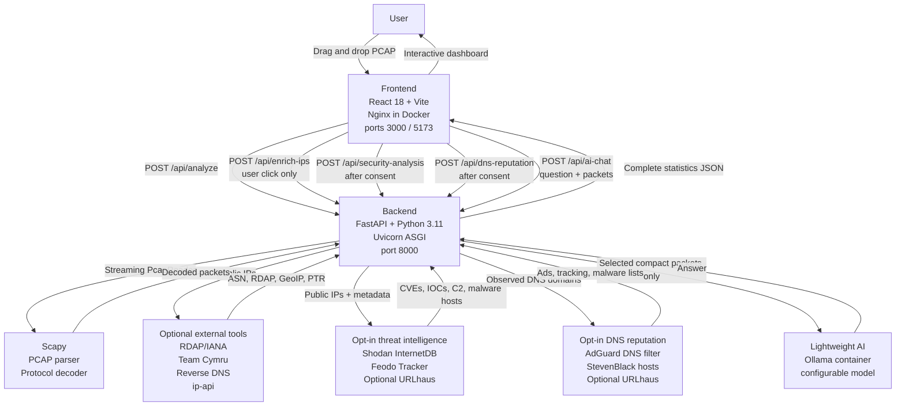
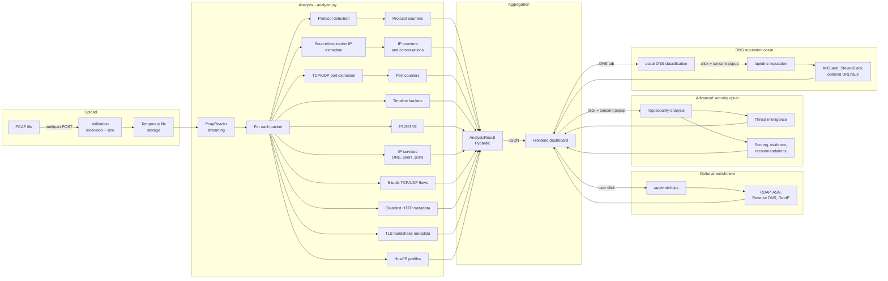

# Architecture & Technology Stack

## System Architecture

## Technology Stack

### Backend

| Technology | Version | Role |
| --- | --- | --- |
| Python | 3.11 | Runtime |
| FastAPI | 0.115 | REST API framework |
| Scapy | 2.6 | PCAP reading and decoding |
| Uvicorn | 0.34 | ASGI server |
| Pydantic | v2 | Data validation and serialization |

### Frontend

| Technology | Version | Role |
| --- | --- | --- |
| React | 18 | UI framework |
| TypeScript | 5.5 | Type safety |
| Vite | 5 | Build tool and development server |
| Tailwind CSS | 3.4 | Utility-first CSS |
| Recharts | 2.12 | Charts |
| Lucide React | — | SVG icons |

### Infrastructure

| Technology | Role |
| --- | --- |
| Docker + Docker Compose | Containerization |
| Nginx 1.27 | Frontend serving and API proxy |
| Ollama | Lightweight local AI model container |

## Analysis Flow

