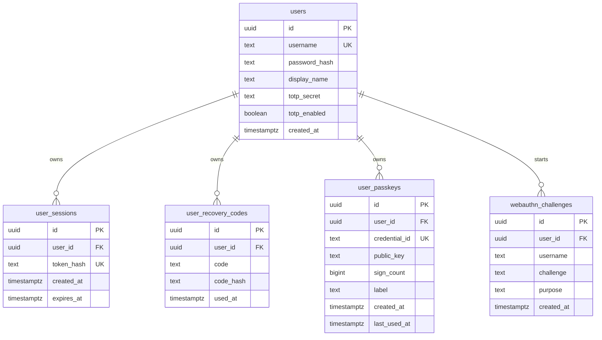
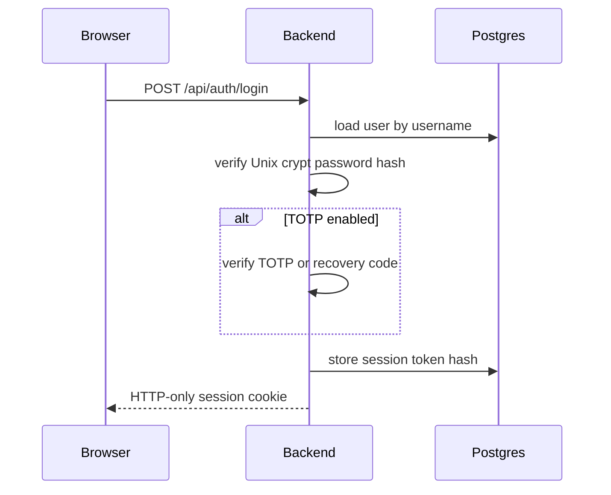

# Users and Authentication

PCAPCaper uses PostgreSQL for users, sessions, TOTP MFA, recovery codes, and passkeys.

Default local account:

```text
username: demo
password: demo
```

The demo password is inserted as a Unix-style SHA-512 `crypt` hash. The plaintext password is never stored in the `users` table.

## Database Model



Analysis reports are still stored as JSON files by default, but each report now carries `owner_user_id`. The API filters list/load/update operations by the authenticated user, so users only see their own analyses. The storage module is intentionally isolated so reports can later move to a PostgreSQL table keyed by `user_id`.

## Login Flow



Session cookies are HTTP-only. The database stores only an HMAC hash of the session token.

## Recovery Codes

Each user receives recovery codes at creation time. They are visible in the user area because they are intended to be saved by the user. For verification, the backend checks `code_hash` with Unix `crypt` and marks the code as used.

The current implementation also stores the displayable code value to satisfy the "visible in the user page" requirement. If this becomes a production multi-user deployment, prefer showing recovery codes only once and storing only hashes.

## TOTP MFA

TOTP is implemented with standard RFC 6238 HMAC-SHA1 codes:

1. User opens the user area.
2. User starts TOTP setup.
3. Backend stores a pending base32 secret.
4. User imports the `otpauth://` URI in an authenticator app.
5. User enters a 6-digit code.
6. Backend enables `totp_enabled`.

When TOTP is enabled, password login requires either a valid TOTP code or an unused recovery code.

## Passkeys

Passkeys use WebAuthn:

1. User requests registration options.
2. Browser calls `navigator.credentials.create`.
3. Backend verifies the attestation and stores credential id, public key, sign count, and label.
4. User can later login with `navigator.credentials.get`.

Important configuration:

```dotenv
PCAPCAPER_WEBAUTHN_RP_ID=localhost
PCAPCAPER_WEBAUTHN_ORIGIN=http://localhost:3000
```

For a real hostname, both values must match the browser URL. Example:

```dotenv
PCAPCAPER_WEBAUTHN_RP_ID=pcapcaper.example.com
PCAPCAPER_WEBAUTHN_ORIGIN=https://pcapcaper.example.com
```

Passkeys require a secure browser context. `localhost` is allowed by browsers for development; remote hosts should use HTTPS.

## PostgreSQL Configuration

Docker Compose starts PostgreSQL with:

```dotenv
PCAPCAPER_POSTGRES_DB=pcapcaper
PCAPCAPER_POSTGRES_USER=pcapcaper
PCAPCAPER_POSTGRES_PASSWORD=pcapcaper
PCAPCAPER_DATABASE_URL=postgresql://pcapcaper:pcapcaper@db:5432/pcapcaper
```

The backend creates and migrates auth tables on startup. The Compose service also mounts:

```text
stuff/db/init -> /docker-entrypoint-initdb.d
```

The current init file is:

```text
stuff/db/init/001-pcapcaper.sql
```

It creates `pgcrypto` and leaves the rest to the backend migration code.

## Production Notes

Change these values before exposing the app:

```dotenv
PCAPCAPER_POSTGRES_PASSWORD=<strong-password>
PCAPCAPER_SESSION_SECRET=<stable-random-secret>
PCAPCAPER_DEFAULT_DEMO_USER_ENABLED=0
PCAPCAPER_WEBAUTHN_RP_ID=<real-hostname>
PCAPCAPER_WEBAUTHN_ORIGIN=https://<real-hostname>
```

If you change PostgreSQL credentials after the volume has already been created, recreate or migrate the `postgres_data` volume; Docker's official Postgres image only applies initial credentials when the data directory is empty.
